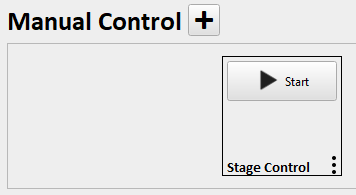
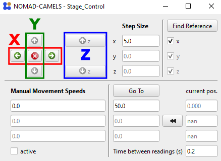

  

    Table of contents
  

  {: .text-delta }
- TOC
{:toc}

# 1. Manual Control
`Manual Control` allows you to set individual instrument channels (e.g. stage in x direction or a voltage output of a SMU)
## 1.1. Add Manual Control
To start  click the &#10133; symbol next to `Manual Control`. You can now select which type of manual control you want to add. The options depend on the instruments you have installed. The most basic manual control is the `Stage_Control` which sets individual channels. It is mainly designed for motorized stages but can be used to control most instruments. 
## 1.2. Configure Manual Control
Select which axis the manual control should use. You must also select from which channel it should read the position (`readback axis`) . This is often the same channel as the `use axis`.

Click `OK` and `start` the manual control.\

This opens the stage control.\
\
Here you can set the step size and use the green arrow keys to control the selected axis. You can also jump to a specific value by entering values below the `Go To` button and then pressing the button.
> &#9888; The value of `Time between readings` is the time in seconds after which the axis is read (using the set `readback axis` channel).

[&#8679; Back to the top &#8679;](#table-of-contents)

  
  <a href="quick_start_protocols.html">&larr; Back</a>
  
  
    <a href="quick_start_plots.html">Next &rarr;</a> 
  

