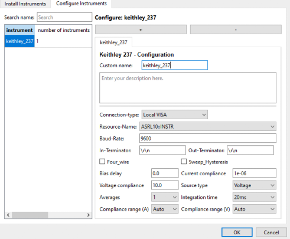

## Table of contents
{: .no_toc }

  

    Table of contents
  

  {: .text-delta }
- TOC
{:toc}

# Keithley 237 - Source Measure Unit (SMU)
# Setup
Basic instructions to add a Keithley 237 SMU to your NOMAD-CAMELS installation.
## Install
Install the instrument using the _Manage Instruments_ button of NOMAD-CAMELS. 

\
Find the instrument under the _Install Instrument_ tab. Then click _Install/Update Selected_ to install the instrument. This uses a pip install internally.

---
## Add Instrument to CAMELS
\
Then go to the _Configure Instrument_ tab and click the &#10133; icon to add a new Keithley 237 instrument.\
You can add as many of the same instrument type as you want by simply clicking the &#10133; additional times if you want to use more than one of the same instruments. 

---
## Configure Device Settings
\
Here you can change the device settings like compliances, averages, integration time, etc.\
**Make sure you set the correct connection type (typically local VISA) and the correct resource name!**\
The communication settings can be changed as well and are device dependant

# Usage
## Source Types
There are **four basic usage types** of the Keithley 237:

1. Source voltage, read current
2. Sweep voltage, read current and voltage (simpley read the set value of the voltage, does not actually measure it)
3. Source current, read voltage
4. Sweep current, read voltage and current (simpley read the set value of the current, does not actually measure it)

> &#9888; The source type of your Keithley 237 must be set in the device configuration window &#9888;

If it is set to _Voltage_ or _Current_ 
 

  <a href="../instruments.html">&larr; Back</a>
  
    Next &rarr;
  

