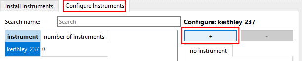
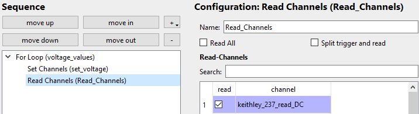
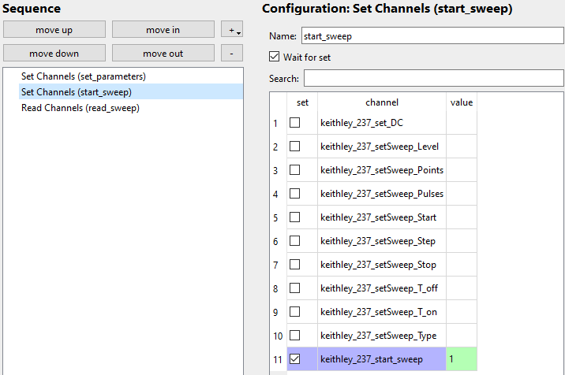
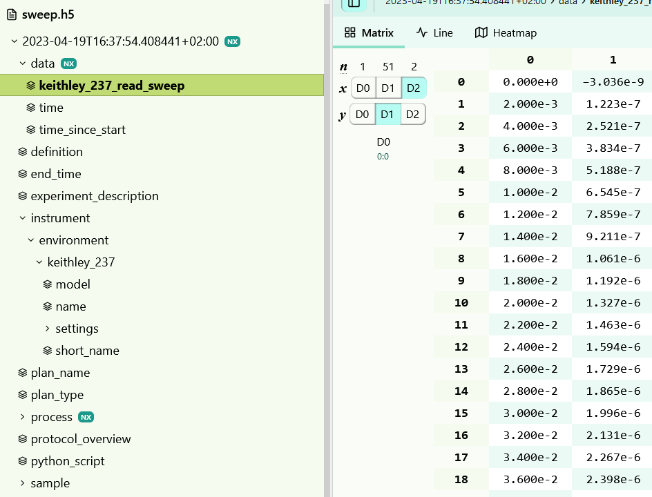

## Table of contents
{: .no_toc }

  

    Table of contents
  

  {: .text-delta }
- TOC
{:toc}

# Keithley 237 - Source Measure Unit (SMU)
# Setup
Basic instructions to add a Keithley 237 SMU to your NOMAD-CAMELS installation.
## Install
Install the instrument using the _Manage Instruments_ button of NOMAD-CAMELS. 

\
Find the instrument under the _Install Instrument_ tab. Then click _Install/Update Selected_ to install the instrument. This uses a pip install internally.

---
## Add Instrument to CAMELS
\
Then go to the _Configure Instrument_ tab and click the &#10133; icon to add a new Keithley 237 instrument.\
You can add as many of the same instrument type as you want by simply clicking the &#10133; additional times if you want to use more than one of the same instruments. 

---
## Configure Device Settings
\
Here you can change the device settings like compliances, averages, integration time, etc.\
**Make sure you set the correct connection type (typically local VISA) and the correct resource name!**\
The communication settings (baud rate, terminators, etc.) can be changed as well and are device dependant.

# Usage
## Source Types
There are **four basic usage types** of the Keithley 237:

1. Source voltage, read current
2. Sweep voltage, read current and voltage (simpley read the set value of the voltage, does not actually measure it)
3. Source current, read voltage
4. Sweep current, read voltage and current (simpley read the set value of the current, does not actually measure it)

> &#9888; The source type of your Keithley 237 must be set in the device configuration window (see image above)

> &#9888; If `Source Type` in the config window is set to `Voltage` or `Current` then it is NOT possible to read the data created during a sweep in a measurement protocol using the `start_sweep` channel.\
> &#9888; If `Source Type` in the config window is set to `Sweep Voltage` or `Sweep Current` then it is NOT possible to read the data from a single measurement protocol using the channel `read_DC`.  
 
## Reading Single Data Points
To read single data points (for example set one voltage and read the corresponding current value in a for-loop) set `Source Type` to `Voltage` or `Current`. Then either current or voltage is measured respectively.\
This is not very fast as the constant device communication has a lot of overhead.

### Example Protocol
Here is an example protocol for setting and reading individual data points.\
#### For-Loop
Settings of the for-loop: it will create 11 values between 0 and 1 including the 1.

#### Set Channel
Sets the `set_DC` channel to the value of the for-loop.\
`set_DC` always sets the source type you selected in the configuration.
 
#### Read Channel
Reads the `read_DC` channel.\
`read_DC` always reads the compliance side of the source type. So it reads voltage when current is sourced and reads current when voltage is sourced.

#### Resulting Data
Example data from such a for-loop measurement. From the recorded instrument setting you will always know what was measured.

  
Display example data

## Using Internal Sweeps
There are five different types of internal sweeps:
1. Fixed Level (`setSweep_type = 0`)
2. Linear Stair (`setSweep_type = 1`)
3. Logarithmic Stair (`setSweep_type = 2`)
4. Linear Stair Pulsed (`setSweep_type = 3`)
5. Logarithmic Stair Pulsed (`setSweep_type = 4`)

For more details on the exact specifications of these internal sweeps check out the [official manual](https://download.tek.com/manual/236_900_01E.pdf) on page 3-47 to 3-56.

The type of sweep measurement is set by writing a value (0 to 4) to the  `setSweep_type` channel (see list above).

Each type requires a different set of parameters from this list :\
`level`, `points`, `pulses`, `start`, `step`, `stop`, `t_off` and `t_on`.

---

Before you start the sweep measurement you have to set the required parameters to the desired value in a measurement step. Here for example for a linear stair sweep from 0 to 1 with step size 0.1.\
&#9888; You MUST set the sweep type here as well: `1 = linear stair`

---

Then you can start the measurement by setting the value of `keithley_237_start_sweep` to `1`

and in a different step you have to start the sweep.

---

To read the measured data simply read the `read_sweep` channel:

---

This produces the following data:

The settings of the sweep can be read from the `protocol_overview` entry and the instrument settings.

  <a href="../instruments.html">&larr; Back</a>
  
    Next &rarr;
  

