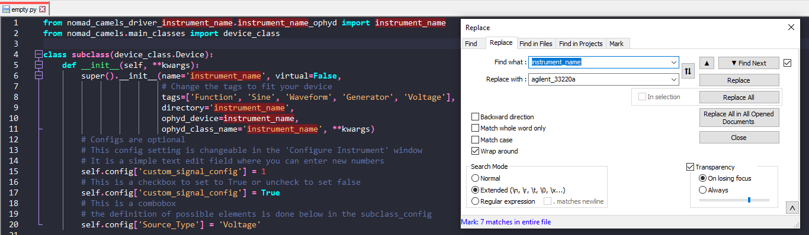
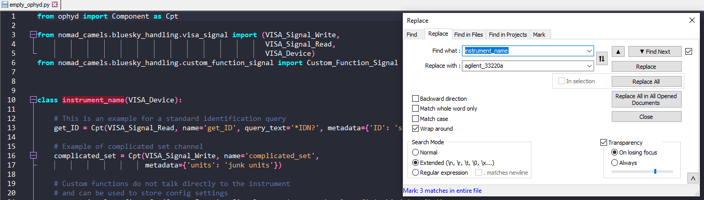

[comment]: <> (## Table of contents)

[comment]: <> ({: .no_toc })


# NOMAD-CAMELS Instrument Drivers
{: .no_toc }
This page should help you create new instrument drivers that can be used in NOMAD-CAMELS.

<details open markdown="block">
  <summary>
    Table of contents
  </summary>
  {: .text-delta }
- TOC
{:toc}
</details>

# How to Create Local Instrument Drivers
## Change CAMELS Settings
If you want to implement a new instrument you need to write a custom instrument driver. The easiest way is to create this instrument driver in folder and set the path for local instrument drivers in CAMELS under `File/Settings` and then `Local drivers path`.

The naming and structure of the driver is important for CAMELS to correctly find and import the local driver. 

## Folder Structure
You can use local instrument drivers by creating this kind of folder structure in the `Local drivers path` specified above.

```
nomad_camels_driver_<instrument_name> (contains the actual device communication files)
└─> <instrument_name>.py
└─> <instrument_name>_ophyd.py
```
CAMELS searches the given `Local drivers path` for folder starting with `nomad_camels_driver_` and extracts the instrument name from the text following this.

## Driver Naming Best-Practice
If you want to create a driver for a new instrument you must create a folder called `nomad_camels_driver_<instrument_name>`, where `<instrument_name>` is a unique and concise name for the instrument you want to implement. 

The name should be completely lower-case and should not contain spaces or dashes, only underscores to indicate spaces. 

If we consider for example a waveform generator called `Agilent 33220A` this would lead to an instrument name of `agilent_33220a`.

## Using File Templates to Create New Instrument
The easiest way to create a new driver is using file templates for the `*.py` and `*_ophyd.py` files. For more details on how the .py and ophyd.py files should look like you can go to the code examples in the [Sections](#221-simple-device-configurations) below.

You can find templates for a new instrument driver [here](https://github.com/FAU-LAP/CAMELS_drivers/tree/main/empty_instrument_driver).

1. Download or copy-and-paste the code of the `empty.py` and `empty_ophyd.py` file.
2. Rename the files to `<instrument_name>.py` and `<instrument_name>_ophyd.py`.\
For example: `agilent_33220a.py` and `agilent_33220a_ophyd.py`
3. Open **both** files with any text editor and search and replace `instrument_name` with the actual name of the instrument you want. Example images below are using Notepad++.



## File Content
### Read and Write Components
To write the actual instrument communication using VISA you create a class inheriting from `nomad_camels.bluesky_handling.visa_signal.VISA_Device` and add components (Cpt) from `ophyd.Components` to this class.

These components are called _channels_ in CAMELS. Components inheriting from `VISA_Signal_Write` or `VISA_Signal_Read` are accessible with the `Read-Channels` and `Set_Channels` step in measurement protocols and can be used by the `Manual Control` functionality.

### Configuration Components
Components that are a `Custom_Function_Signal` with the parameter `kind='config'` are used in the configuration of the instrument (`Managa Instruments` and then `Configure Instruments` in the GUI).

To configure the instrument settings you need to create a UI for these settings. You can either do this your self using QtDesigner for example or you can automatically generate a  `Configure Instruments`-UI using the `device_class.Simple_Config` class. 

> For complicated instruments with many settings or multiple channels you must write your own UI.

> For simple instruments you can use the automatically generated settings UI. 

Refer to the `empty.py` file from [here](https://github.com/FAU-LAP/CAMELS_drivers/blob/main/empty_instrument_driver/empty.py) to learn how to use the automatic UI generation.


## Advanced Driver Information

**Regarding the `*.py` file.**

It should include a class `subclass` which inherits from `nomad_camels.main_classes.device_class.Device`.
The arguments here should be set in the __init__ by the subclass (following) the documentation of the Device class.
For most devices, nothing further should be necessary in this class.

The `subclass_config`, inheriting from `nomad_camels.main_classes.device_class.Device_Config` should provide the necessary configuration for the device and put this information into the device's `config`, `settings` and `ioc_settings` attributes.

**Regarding the `*ophyd.py` file.**

For VISA devices this should include a class (meaningfully named) inheriting from `nomad_camels.bluesky_handling.visa_signal`.
Here you may set all the components the device has. \
Components that are created with kind='normal' (or not specified) will appear as channels inside CAMELS. Channels can be set and read and are the main way CAMELS communicates with devices during measurements. \
Components with `kind='config'` are part of the configuration-widget.


---

# Writing New Instrument Drivers for PyPi
Every instrument driver should be an individual [PyPi](https://pypi.org/) package.\
It is possible to create drivers that are only available locally for you. 
> &#9888; 
> Currently the drivers are located in [testPyPi.org](https://testPyPi.org/). &#9888;\
> This will be changed to [PyPi.org](https://PyPi.org/) once the devices are stable.

The source code of each driver can be found in [this repository](https://github.com/FAU-LAP/CAMELS_drivers).
## Folder structure
The driver should have the following folder structure
```
<instrument_name>
└─> dist (this is automatically created by python -m build)
    └─> nomad_camels_driver_<instrument_name>-X.Y.Z.tar.gz
    └─> nomad_camels_driver_<instrument_name>-X.Y.Z-py3-none-any.whl
└─> nomad_camels_driver_<instrument_name> (contains the actual device communication files)
    └─> <instrument_name>.py
    └─> <instrument_name>_ophyd.py
└─> LICENSE.txt
└─> pyproject.toml
└─> README.md
```
The most important files are the `<instrument_name>.py` and `<instrument_name>_ophyd.py` files. The first one contains everything that is needed by the NOMAD-CAMELS GUI. The latter contains the class that is actually used for communicating with the device.  
The `pyproject.toml` file contains most of the relevant information concerning the package that will be uploaded to PyPi ([see here for more information](https://setuptools.pypa.io/en/latest/userguide/quickstart.html)).\
&#9888; Most importantly the project name and version must be set in the `pyproject.toml` file.

---
## Code Example .toml
<details>
  <summary>Code example: pyproject.toml file for the  Keithley 237</summary>


[build-system]
requires = ["setuptools>=61.0"]
build-backend = "setuptools.build_meta"

[project]
name = "nomad_camels_driver_keithley_237"
version = "0.1.4"
authors = [
    { name="FAIRmat - HU Berlin", email="nomad-camels@fau.de" }
]
description = "Device driver for the Keithley 237 SMU."
readme = "README.md"
requires-python = ">=3.9.6"
classifiers = [
    "Programming Language :: Python :: 3",
    "License :: OSI Approved :: GNU Lesser General Public License v2 (LGPLv2)",
    "Operating System :: Microsoft :: Windows",
]
dependencies = [
    "pyvisa",
]
[project.urls]
"GitHub Page" = "https://github.com/FAU-LAP/NOMAD-CAMELS"
"Documentation" = "https://fau-lap.github.io/NOMAD-CAMELS/"


</details>

---

# Python files
The `<instrument_name>.py` file contains information about the possible instrument configurations and settings. This can be for example the current compliance of a voltage source or the integration time of a digital multimeter.
## Simple Device Configurations
> &#9888; For **simple instruments** with only a **few settings** you do not need to write your own GUI for the settings but CAMELS can auto-generate the UI for you. \
> An example file is displayed below:

---

<details>
  <summary>Code example: Use the auto-generated UI for instrument settings (for Keithley 237)</summary>


from nomad_camels_driver_keithley_237.keithley_237_ophyd import Keithley_237 # Change this line!
from nomad_camels.main_classes import device_class

class subclass(device_class.Device):
    def __init__(self, **kwargs):
        # You can search for individual tags in the NOMAD-CAMELS GUI
        super().__init__(name='keithley_237', virtual=False, tags=['DMM', 'voltage', 'current',],       
                         directory='keithley_237', ophyd_device=Keithley_237, 
                         ophyd_class_name='Keithley_237', **kwargs)
        # These are the default values of the configuration settings  
        self.config['Four_wire'] = False
        self.config['Averages'] = "1"
        self.config['Integration_time'] = "20ms"
        self.config['Current_compliance_range'] = "Auto"
        self.config['Current_compliance'] = 1e-6
        self.config['Voltage_compliance_range'] = "Auto"
        self.config['Voltage_compliance'] = 10
        self.config['Bias_delay'] = 0
        self.config['Source_Type'] = "Voltage"
        self.config['Sweep_Hysteresis'] = False

# This adds a simple GUI of the configuration settings that you add below. 
# This way you do NOT need to write our own GUI for the instrument settings.
# This can be used for simple instruments with only a few settings.
# For more complicated instruments (with e.g. multiple channels) it might be necessary to write a more advanced GUI
class subclass_config(device_class.Simple_Config):
    def __init__(self, parent=None, data='', settings_dict=None,
                 config_dict=None, ioc_dict=None, additional_info=None):
        # Each dictionary entry become a combo box with the values ad drop down optins
        comboBoxes = {'Source_Type': ["Voltage", "Current", "Sweep Voltage", "Sweep Current"],
                      'Current_compliance_range': ["Auto", "1nA", "10nA", "100nA", "1uA",
                                             "10uA", "100uA", "1mA", "10mA", "100mA"],
                      'Voltage_compliance_range': ["Auto", "1.1V", "11V", "110V", "1100V"],
                      "Averages": ["1", "2", "4", "8", "16", "32"],
                      'Integration_time': ["20ms", "4ms", "0.4ms"],
                      }
        # Optional
        # Creates labels for each of the self.config elements. This is useful to add units to the settings. 
        labels = {'Source_Type': 'Source type',
                  'Current_compliance_range': 'Compliance range (A)',
                  'Voltage_compliance_range': 'Compliance range (V)',
                  'Integration_time': 'Integration time',
                  'Four_wire': 'Four wire',
                  'Current_compliance': 'Current compliance',
                  'Voltage_compliance': 'Voltage compliance',
                  'Bias_delay': 'Bias delay',
                  'Sweep_Hysteresis': 'Sweep Hysteresis',
                  }
        super().__init__(parent, 'Keithley 237', data, settings_dict,
                         config_dict, ioc_dict, additional_info, comboBoxes=comboBoxes, labels=labels)
        self.comboBox_connection_type.addItem('Local VISA')
        self.load_settings()


</details>

---

## Complex Device Configurations
If the instrument is more complex CAMELS can not auto generate the UI anymore. Here you need to write your own UI using for example QT Designer. The first three class definitions are relevant for this. 

---

<details>
  <summary>Code example: Use your own UI file to create settings for your instrument (for Andor Shamrock spectrograph)</summary>


from CAMELS.main_classes import device_class
from .andor_shamrock_500_config import Ui_andor_shamrock500_config
from .andor_shamrock_500_ophyd import Andor_Shamrock_500
from PySide6.QtWidgets import QTabWidget


class subclass(device_class.Device):
    def __init__(self, **kwargs):
        super().__init__(name='andor_shamrock_500', virtual=False,
                         tags=[ 'spectrometer', 'spectrum', 'Andor',],
                         directory='andor_shamrock_500', ophyd_device=Andor_Shamrock_500,
                         ophyd_class_name='Andor_Shamrock_500', **kwargs)

class subclass_config(device_class.Device_Config):
    def __init__(self, parent=None, data='', settings_dict=None, config_dict=None, additional_info=None, **kwargs):
        super().__init__(parent, 'Andor Shamrock 500', data, settings_dict=settings_dict, config_dict=config_dict, additional_info=additional_info, no_ioc_connection=True, **kwargs)
        self.comboBox_connection_type.addItem('Windows dll')
        # self.comboBox_connection_type.addItem('Local VISA')
        self.tab_widget = QTabWidget()
        conf1 = {}
        for key, val in config_dict.items():
            if key.endswith('1'):
                conf1[key[:-1]] = val
        # !!!!!!!!!!!!!!!!!!!!!!!!!!!!!!!
        # Here you add your own UI as a tab widget. This is the key part !!!!!  
        # !!!!!!!!!!!!!!!!!!!!!!!!!!!!!!!
        self.channel_widge_1 = subclass_config_sub(config_dict=conf1, parent=parent, settings_dict=settings_dict)
        self.tab_widget.addTab(self.channel_widge_1, 'Settings')
        self.layout().addWidget(self.tab_widget, 20, 0, 1, 5)
        self.load_settings()

    def get_config(self):
        conf1 = self.channel_widge_1.get_config()
        for key, val in conf1.items():
            self.config_dict[f'{key}1'] = val
        return super().get_config()

# This inherits from your UI and is used above to create the tab widget with all the settings you implemented.
class subclass_config_sub(device_class.Device_Config_Sub, Ui_andor_shamrock500_config):
    def __init__(self, config_dict=None, parent=None, settings_dict=None):
        super().__init__(parent=parent, config_dict=config_dict,
                         settings_dict=settings_dict)
        self.setupUi(self)
        if 'set_grating_number' in self.config_dict:
            self.set_grating_number.setValue(self.config_dict['set_grating_number'])
        if 'initial_wavelength' in self.config_dict:
            self.initial_wavelength.setValue(self.config_dict['initial_wavelength'])
        if 'input_port' in self.config_dict:
            self.input_port.setCurrentText(self.config_dict['input_port'])
        if 'output_port' in self.config_dict:
            self.output_port.setCurrentText(self.config_dict['output_port'])
        if 'select_camera' in self.config_dict:
            self.select_camera.setCurrentText(self.config_dict['select_camera'])
        if 'input_slit_size' in self.config_dict:
            self.input_slit_size.setValue(self.config_dict['input_slit_size'])
        if 'output_slit_size' in self.config_dict:
            self.output_slit_size.setValue(self.config_dict['output_slit_size'])

    def get_config(self):
        self.config_dict['set_grating_number'] = self.set_grating_number.value()
        self.config_dict['initial_wavelength'] = self.initial_wavelength.value()
        self.config_dict['input_port'] = self.input_port.currentText()
        self.config_dict['output_port'] = self.output_port.currentText()
        self.config_dict['select_camera'] = self.select_camera.currentText()
        self.config_dict['input_slit_size'] = self.input_slit_size.value()
        self.config_dict['output_slit_size'] = self.output_slit_size.value()
        return super().get_config()


</details>

---

Here is a more complex example which creates settings for two channels of a single instrument.
<details>
  <summary>Code example: Two separate channels (for Keysight 2912)</summary>


from nomad_camels.main_classes import device_class
from keysight_b2912.keysight_b2912_channel_config import Ui_B2912_channel # You need to import the created UI file
from keysight_b2912.keysight_b2912_ophyd import Keysight_B2912 # Import the actual device communication
from PySide6.QtWidgets import QTabWidget

# Default settings of the instrument
default_settings = {'source': 'Voltage',
                    'source_range': '2E-1 V',
                    'range_lower_lim': '2E-1 V',
                    'source_auto': True,
                    'low_terminal': 'Ground',
                    'current_auto_mode': True,
                    'current_lower_lim': '1E-8 A',
                    'current_range': '1E-8 A',
                    'voltage_range': '2E-1 V',
                    'voltage_auto_mode': True,
                    'voltage_lower_lim': '2E-1 V',
                    'resistance_range': '2 Ohm',
                    'resistance_upper_lim': '200E6 Ohm',
                    'output_protection': False,
                    'four_wire_meas': False,
                    'current_auto_range': True,
                    'voltage_auto_range': True,
                    'resistance_auto_range': True,
                    'resistance_compensation': False,
                    'voltage_compliance': 2,
                    'current_compliance': 2,
                    'NPLC': 1}

# Similar to the simple device
class subclass(device_class.Device):
    def __init__(self, **kwargs):
        super().__init__(name='keysight_b2912', virtual=False, tags=['SMU', 'voltage', 'current', 'resistance'], directory='keysight_b2912', ophyd_device=Keysight_B2912, ophyd_class_name='Keysight_B2912', **kwargs)
        # This sets the default settings for each channel
        for key, val in default_settings.items():
            self.config[f'{key}1'] = val
            self.config[f'{key}2'] = val

class subclass_config(device_class.Device_Config):
    def __init__(self, parent=None, data='', settings_dict=None, config_dict=None, additional_info=None, **kwargs):
        super().__init__(parent, 'Keysight B2912', data, settings_dict=settings_dict, config_dict=config_dict, additional_info=additional_info, no_ioc_connection=True, **kwargs)
        self.comboBox_connection_type.addItem('Local VISA')
        self.tab_widget = QTabWidget()
        conf1 = {}
        conf2 = {}
        for key, val in config_dict.items():
            if key.endswith('1'):
                conf1[key[:-1]] = val
            elif key.endswith('2'):
                conf2[key[:-1]] = val
        # !!!!!!!!!!!!!!!!!!!!!!!!!!!!!!!
        # Here you add your own UI as a tab widget. This is the key part !!!!!  
        # !!!!!!!!!!!!!!!!!!!!!!!!!!!!!!!
        self.channel_widge_1 = subclass_config_sub(config_dict=conf1, parent=parent, settings_dict=settings_dict)
        self.channel_widge_2 = subclass_config_sub(config_dict=conf2, parent=parent, settings_dict=settings_dict)
        self.tab_widget.addTab(self.channel_widge_1, 'Channel 1')
        self.tab_widget.addTab(self.channel_widge_2, 'Channel 2')
        self.layout().addWidget(self.tab_widget, 20, 0, 1, 5)
        self.load_settings()

    def get_config(self):
        conf1 = self.channel_widge_1.get_config()
        conf2 = self.channel_widge_2.get_config()
        for key, val in conf1.items():
            self.config_dict[f'{key}1'] = val
        for key, val in conf2.items():
            self.config_dict[f'{key}2'] = val
        return super().get_config()

# This inherits from the UI class you wrote for the UI config settings of the instrument
class subclass_config_sub(device_class.Device_Config_Sub, Ui_B2912_channel):
    def __init__(self, config_dict=None, parent=None, settings_dict=None):
        super().__init__(parent=parent, config_dict=config_dict,
                         settings_dict=settings_dict)
        self.setupUi(self)

        self.sources = ['Voltage', 'Current']
        self.comboBox_source.addItems(self.sources)
        if 'source' in config_dict and config_dict['source'] in self.sources:
            self.comboBox_source.setCurrentText(config_dict['source'])

        self.low_terminals = ['Ground', 'Float']
        self.comboBox_low_terminal.addItems(self.low_terminals)
        if 'low_terminal' in config_dict and config_dict['low_terminal'] in self.low_terminals:
            self.comboBox_low_terminal.setCurrentText(config_dict['source'])

        self.ranges_voltage = ['2E-1 V', '2 V', '20 V', '200 V']
        self.ranges_current = ['1E-8 A', '1E-7 A', '1E-6 A', '1E-5 A', '1E-4 A', '1E-3 A', '1E-2 A', '1E-1 A', '1 A', '1.5 A', '3 A', '10 A']
        self.ranges_resistance = ['2 Ohm', '20 Ohm', '200 Ohm', '2E3 Ohm', '20E3 Ohm', '200E3 Ohm', '2E6 Ohm', '20E6 Ohm', '200E6 Ohm']

        if 'source_auto' in self.config_dict:
            self.checkBox_source_auto.setChecked(self.config_dict['source_auto'])
        else:
            self.checkBox_source_auto.setChecked(True)

        self.load_source_options()
        self.checkBox_source_auto.clicked.connect(self.load_source_options)
        self.comboBox_source.currentTextChanged.connect(self.load_source_options)

        if 'output_protection' in config_dict:
            self.checkBox_output_protection.setChecked(config_dict['output_protection'])
        if 'current_compliance' in config_dict:
            self.lineEdit_current_compliance.setText(str(config_dict['current_compliance']))
        else:
            self.lineEdit_current_compliance.setText('0.1')
        if 'voltage_compliance' in config_dict:
            self.lineEdit_voltage_compliance.setText(str(config_dict['voltage_compliance']))
        else:
            self.lineEdit_voltage_compliance.setText('2')

        if 'NPLC' in config_dict:
            self.lineEdit_NPLC.setText(str(config_dict['NPLC']))
        else:
            self.lineEdit_NPLC.setText('1')

        if 'four_wire_meas' in config_dict:
            self.checkBox_four_wire_meas.setChecked(config_dict['four_wire_meas'])
        if 'current_auto_range' in config_dict:
            self.checkBox_current_auto_range.setChecked(config_dict['current_auto_range'])
        if 'voltage_auto_range' in config_dict:
            self.checkBox_voltage_auto_range.setChecked(config_dict['voltage_auto_range'])
        if 'resistance_auto_range' in config_dict:
            self.checkBox_resistance_auto_range.setChecked(config_dict['resistance_auto_range'])
        if 'resistance_compensation' in config_dict:
            self.checkBox_resistance_compensation.setChecked(config_dict['resistance_compensation'])

        auto_range_modes = ['Normal', 'Resolution', 'Speed']
        self.comboBox_voltage_auto_mode.addItems(auto_range_modes)
        self.comboBox_current_auto_mode.addItems(auto_range_modes)
        if 'voltage_auto_mode' in config_dict and config_dict['voltage_auto_mode'] in auto_range_modes:
            self.comboBox_voltage_auto_mode.setCurrentText(config_dict['voltage_auto_mode'])
        if 'current_auto_mode' in config_dict and config_dict['current_auto_mode'] in auto_range_modes:
            self.comboBox_current_auto_mode.setCurrentText(config_dict['current_auto_mode'])

        self.comboBox_current_lower_lim.addItems(self.ranges_current)
        if 'current_lower_lim' in self.config_dict and self.config_dict['current_lower_lim'] in self.ranges_current:
            self.comboBox_current_lower_lim.setCurrentText(self.config_dict['current_lower_lim'])
        self.comboBox_current_range.addItems(self.ranges_current)
        if 'current_range' in self.config_dict and self.config_dict['current_range'] in self.ranges_current:
            self.comboBox_current_range.setCurrentText(self.config_dict['current_range'])
        self.comboBox_voltage_lower_lim.addItems(self.ranges_voltage)
        if 'voltage_lower_lim' in self.config_dict and self.config_dict['voltage_lower_lim'] in self.ranges_voltage:
            self.comboBox_voltage_lower_lim.setCurrentText(self.config_dict['voltage_lower_lim'])
        self.comboBox_voltage_range.addItems(self.ranges_voltage)
        if 'voltage_range' in self.config_dict and self.config_dict['voltage_range'] in self.ranges_voltage:
            self.comboBox_voltage_range.setCurrentText(self.config_dict['voltage_range'])
        self.comboBox_resistance_range.addItems(self.ranges_resistance)
        if 'resistance_range' in self.config_dict and self.config_dict['resistance_range'] in self.ranges_resistance:
            self.comboBox_resistance_range.setCurrentText(self.config_dict['resistance_range'])
        self.comboBox_resistance_upper_lim.addItems(self.ranges_resistance)
        if 'resistance_upper_lim' in self.config_dict and self.config_dict['resistance_upper_lim'] in self.ranges_resistance:
            self.comboBox_resistance_upper_lim.setCurrentText(self.config_dict['resistance_upper_lim'])


    def load_source_options(self):
        src_v = True
        if self.comboBox_source.currentText() == 'Current':
            src_v = False
        auto_source = self.checkBox_source_auto.isChecked()
        self.comboBox_source_range.clear()
        self.comboBox_range_lower_lim.clear()
        if src_v:
            self.comboBox_source_range.addItems(self.ranges_voltage)
            self.comboBox_range_lower_lim.addItems(self.ranges_voltage)
            if 'source_range' in self.config_dict and self.config_dict['source_range'] in self.ranges_voltage:
                self.comboBox_source_range.setCurrentText(self.config_dict['source_range'])
            if 'range_lower_lim' in self.config_dict and self.config_dict['range_lower_lim'] in self.ranges_voltage:
                self.comboBox_range_lower_lim.setCurrentText(self.config_dict['range_lower_lim'])
        else:
            self.comboBox_source_range.addItems(self.ranges_current)
            self.comboBox_range_lower_lim.addItems(self.ranges_current)
            if 'source_range' in self.config_dict and self.config_dict['source_range'] in self.ranges_current:
                self.comboBox_source_range.setCurrentText(self.config_dict['source_range'])
            if 'range_lower_lim' in self.config_dict and self.config_dict['range_lower_lim'] in self.ranges_current:
                self.comboBox_range_lower_lim.setCurrentText(self.config_dict['range_lower_lim'])
        self.comboBox_source_range.setEnabled(not auto_source)
        self.comboBox_range_lower_lim.setEnabled(auto_source)


    def get_config(self):
        self.config_dict['source'] = self.comboBox_source.currentText()
        self.config_dict['low_terminal'] = self.comboBox_low_terminal.currentText()
        self.config_dict['source_range'] = self.comboBox_source_range.currentText()
        self.config_dict['range_lower_lim'] = self.comboBox_range_lower_lim.currentText()
        self.config_dict['current_auto_mode'] = self.comboBox_current_auto_mode.currentText()
        self.config_dict['current_lower_lim'] = self.comboBox_current_lower_lim.currentText()
        self.config_dict['current_range'] = self.comboBox_current_range.currentText()
        self.config_dict['voltage_range'] = self.comboBox_voltage_range.currentText()
        self.config_dict['voltage_auto_mode'] = self.comboBox_voltage_auto_mode.currentText()
        self.config_dict['voltage_lower_lim'] = self.comboBox_voltage_lower_lim.currentText()
        self.config_dict['resistance_range'] = self.comboBox_resistance_range.currentText()
        self.config_dict['resistance_upper_lim'] = self.comboBox_resistance_upper_lim.currentText()
        self.config_dict['source_auto'] = self.checkBox_source_auto.isChecked()
        self.config_dict['output_protection'] = self.checkBox_output_protection.isChecked()
        self.config_dict['four_wire_meas'] = self.checkBox_four_wire_meas.isChecked()
        self.config_dict['current_auto_range'] = self.checkBox_current_auto_range.isChecked()
        self.config_dict['voltage_auto_range'] = self.checkBox_voltage_auto_range.isChecked()
        self.config_dict['resistance_auto_range'] = self.checkBox_resistance_auto_range.isChecked()
        self.config_dict['resistance_compensation'] = self.checkBox_resistance_compensation.isChecked()
        self.config_dict['current_compliance'] = float(self.lineEdit_current_compliance.text())
        self.config_dict['voltage_compliance'] = float(self.lineEdit_voltage_compliance.text())
        self.config_dict['NPLC'] = float(self.lineEdit_NPLC.text())
        return super().get_config()


</details>

---

# How to Upload Driver to PyPi

## Build the Instrument Package
To create a new package that can be installed via pip from _PyPi_ or _testPyPi_ follow these steps.
1. Make sure you have `build` and `twine` installed into your python environment with `pip install build` and `pip install twine`
2. Go to the `<instrument_name>` directory of the driver. So the parent directory containing the pyproject.toml 
3. Set the correct version number and metadata in your `pyproject.toml` file
4. Run the build command : `python -m build`. This creates the `dist/` folder and the distributions to upload to PyPi
5. Upload to testPyPi (PyPi) with 
    ```console
    python -m twine upload --repository testpypi dist/nomad*
    ```
   &#9888; Change the repository used after the `--repository` flag to `pypi` to upload to PyPi

---

## Automated Build and Upload
You can run the following script using microsoft PowerShell in the `$rootFolder` containing multiple instrument drivers in subdirectories.\
It runs the `python -m build` and `python -m twine upload -r testpypi dist/nomad*` commands in each subdirectory containing a `pyproject.toml` file.

```powershell
$rootFolder = "C:\Path\To\Root\Folder"
Get-ChildItem $rootFolder -Recurse -Directory | ForEach-Object {
    if (Test-Path "$($_.FullName)\pyproject.toml") {
        Push-Location $_.FullName
        python -m build
        python -m twine upload -r testpypi dist/nomad*
        Pop-Location
    }
}
```


---

## Install Instrument Package
To install  run 
```console
pip install --no-cache-dir --index-url https://test.pypi.org/simple/ --extra-index-url https://pypi.org/simple nomad_camels_driver_<instrument_name>
```
where `nomad_camels_driver_<instrument_name>` is the driver name you gave your folder and project.\
The `--extra-index-url` flag allows dependencies to be installed from PyPi.\
The `--no-cache-dir` flag prevents any locally saved NOMAD-CAMELS version to be installed instead of the most recent remote version.\
> &#9888; The index-url must be changed of course when installing from PyPi &#9888;

---


<p style="text-align:left;">
  <span style="color: grey;">
  <a href="../index.html">&larr; Back</a>
  </span>
  <span style="float:right;">
    <a href="quick_start.html">Next &rarr;</a><br>
  </span>
</p>
