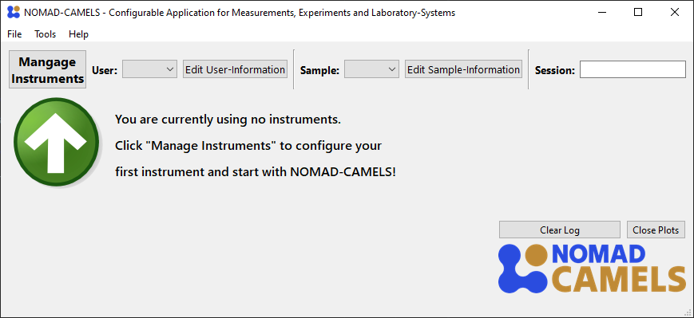

# Quick Start Guide
This guide follows after the installation, to make you familiar with the main functionalities of NOMAD-CAMELS (short: CAMELS).

  

    Table of contents
  

  {: .text-delta }
- TOC
{:toc}

## 1. Installing and configuring instruments
### 1.1. Installing instruments
When you first start up NOMAD-CAMELS, you should see something like the following:  
  
Clicking on the "Manage Instruments" button will open a dialog where you can install available instruments from the CAMELS repository.  
  
After the install is successfull

  
  <a href="installation.html">&larr; Back</a>
  
  
    <a href="users_guide.html">Next &rarr;</a> 
  

