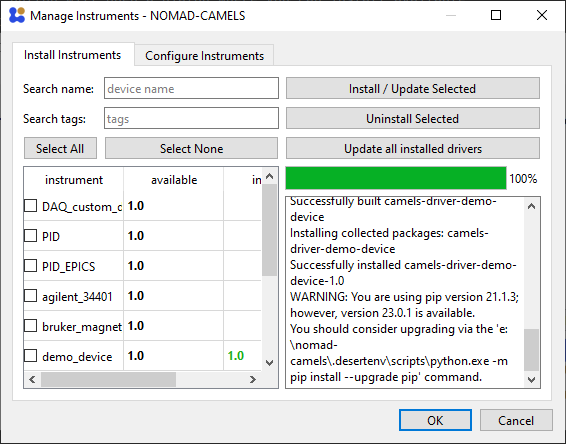

## Table of contents
{: .no_toc }

  

    Table of contents
  

  {: .text-delta }
- TOC
{:toc}

# Quick Start Guide
This guide should help you get to know the main functionalities of NOMAD-CAMELS (short: CAMELS) after a successful [installation](https://fau-lap.github.io/NOMAD-CAMELS/docs/installation.html).

## 1. Installing and configuring instruments
### 1.1. Installing instruments
When you first start up NOMAD-CAMELS, you should see something like the following:  
  
Clicking on the "Manage Instruments" button will open a dialog where you can install available instruments from the CAMELS repository (PyPi). For this tutorial we use the "demo_device".

|                                    Select device                                     |                  Successful Installation                   |
|:------------------------------------------------------------------------------------:|:----------------------------------------------------------:|
|  |  |

After successful installation (second picture above), you can switch to the "Configure Instruments" tab.

  
  <a href="installation.html">&larr; Back</a>
  
  
    <a href="users_guide.html">Next &rarr;</a> 
  

