## 0. Table of contents
{: .no_toc }

  

    Table of contents
  

  {: .text-delta }
- TOC
{:toc}

# Quick Start Guide
This guide should help you get to know the main functionalities of NOMAD-CAMELS (short: CAMELS) after a successful [installation](https://fau-lap.github.io/NOMAD-CAMELS/docs/installation.html).

## 1. Installing and Configuring Instruments
### 1.1. Installing Instruments
When you first start up NOMAD-CAMELS, you should see something like the following:  

Clicking on the "Manage Instruments" button will open a dialog where you can install available instruments from the CAMELS repository (PyPi).\
For this tutorial we use the "demo_device".

  
   

On the left we can see the instrument selection window. 
- Simply check the instruments you want to install. 
- Then click `Install / update Selected` to install the most recent version of the instrument from PyPi via a simple `pip install <instrument_name>`

On the right you can see the screen after successful installation of the instruments. 

---

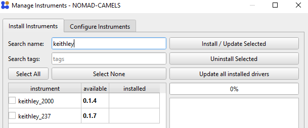

You can also filter the instruments by their name using the `Search name` field as you see here in the right image.

    

---

### 1.2. Configuring Instruments

After successful installation you can switch to the "Configure Instruments" tab.\
Here all the available instruments are listed as well as the number of instances (so 'actual' instruments) you have added of the installed instrument type.\
For this simply select the instrument type you want to add and click the &#10133; symbol under `Configure`.

  
   

After adding the instrument a new instance of this instrument type is created. You can add as many instances of devices as you like by simply pushing the &#10133; symbol. This adds additional tabs with the `Custom name` you gave the instrument. By default, the naming simply increments a number after the device name.

---

You can then change the instrument settings as you wish.\
You can also add a plain text description of the instrument and what you are planning to do with it. This is added to the metadata of your measurement when the instrument is used. This can help you better understand what the instrument does for larger project and allows others to better understand your measurement data.

  
  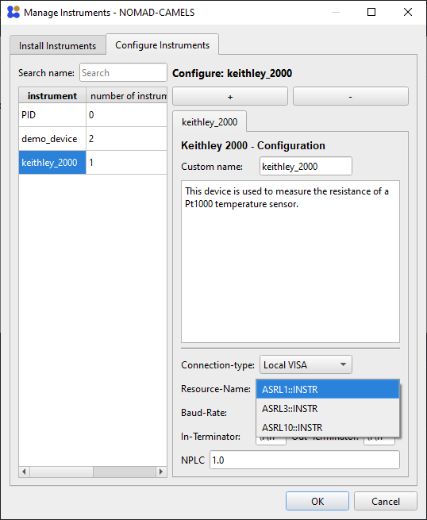 

---

When you are happy with the instruments settings and have added all the instruments required for your measurements you can simply click `OK` to save all the instruments and settings to CAMELS.

# Using Instruments
After adding at least one instrument to CAMELS you now have two ways to control the instrument: 
1. [_Measurement Protocols_](#2-measurement-protocols) Use it for sophisticated measurement procedures.
2. [_Manual Control_](#3-manual-control) Manually change and control individual channels. This is useful for controlling stages without having to create a protocol.

[Back to the top](#0-table-of-contents)
## 2. Measurement Protocols
Measurement protocols are the main way in which CAMELS performs measurements. It can be understood as something similar to a `measurement recipe` where a step for step guide is given to different instruments to perform a measurement procedure.

A good example of such a measurement procedure is a temperature dependant current-voltage (IV) measurement. Here the temperature of a sample is set to a specific value with a PID controller and waits for the temperature to be stable. Then it performs an IV-sweep, so it sets a voltage and measures the accompanying current for a given range of voltage values (often something like 100 points between -1 V and +1V).\
The temperature set-points are also varied to values in a given range (for example from 295K to 320K in 25 steps).\
So one would need to nest different loops (one for setting teh temperature and one for setting the voltage). This can be done quite simply using CAMELS.

---

### 2.1. Simple Start with _demo_device_
But let's start very simple with the `demo_device` which is a pure software implementation of an instrument. 

Start by clicking the large &#10133; symbol next to `Measurement Protocols`. This opens up and empty protocol window.

Here you can fully configure the measurement routine you want to perform. Give the protocol a custom name using `Protocol Name`. With `Filename` you set the name of data file that is created during the measurement. You can also add a custom description to describe what your measurement protocol does.

One key part of this window is the `Sequence` element on the left.
Here you will configure the individual steps of the measurement procedure.

Simply right click into the empty space (left image below) or use the small &#10133; symbol in the top right to add a new step (right image below). 

  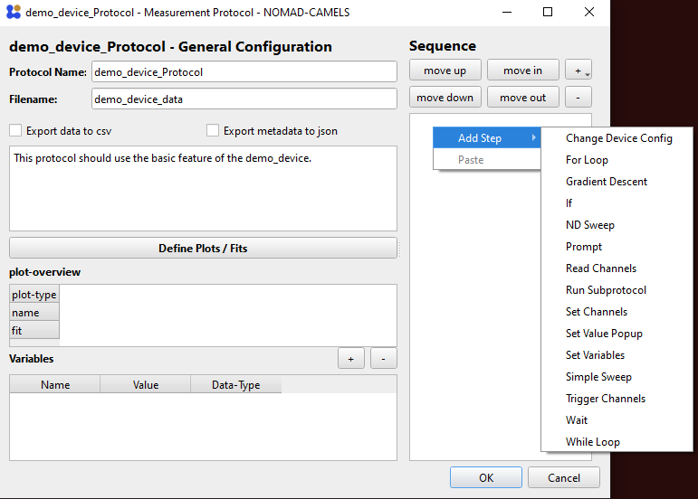
   

---

We can now add two of the most important steps:
- **Set Channels**
- **Read Channels**
 

Each device has specific `channels` which can be read and set (changed) or only read.
Depending on the exact implementation of the instruments channels they are either 'software channels' so they themselves do not actually require device communication but store important values or settings, or they are 'instrument channels' and either `read from` or `write to` the instrument (or both). 

Below you can see the readable and the settable channels of a single `demo_device`. 

  
   

[Back to the top](#0-table-of-contents)

---

### 2.2. Single Set and Read
Lets see how you can set and read individual cahnnels.

#### Set
We can now configure the protocol so that first each motor channel (`X`,`Y`,`Z`) are set to a value (in this case `1`,`2`,`3`).

  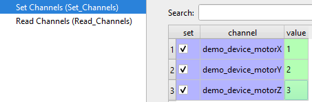
   

The green background of the `value` field tells you that CAMELS understands the entry as it expects to see a number (float) here. If you enter a value which CAMELS can not convert to float it will change the background to red (see image on the right).

&#9888; You can use variables instead of 'hard-coding' values.\
&#9888; You can use most symbolic math operations in the value field to perform calculations before setting the result of the calculation.\
For this simply add a variable on the bottom right of the protocol screen with the &#10133; symbol

  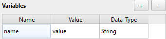
   

and change the `Name` and `Value` to what ever you need. The `Data-Type` will change depending on the value you input and can be used to make sure that CAMELS correctly 'understands' the value.

To use this variable in the protocol (here in `Set Channels`) simply right-click the value field and `insert` or `append` the desired variable you created.\
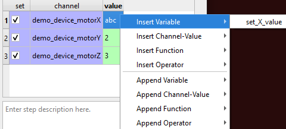

- `Insert` will overwrite any existing value in the field 
- `Append` will add the string name of the variable at the end of the value field. This is useful when creating longer functions with multiple variables.

You can use math notation as you would in a normal pythons script (you can use `np.*` variables; like `np.sin(1)`) to perform calculations before setting the value:\
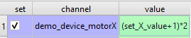\
This should evaluate to `(1+1)*2=4`. You can also insert or append 
- functions
- operators 
- channel values

---

#### Read
To read the channels we just set, simply configure the `Read Channels` step to read the three motor channels:\
\
You can now run the protocol by confirming the configuration with `OK` and then pressing the `run` button.\
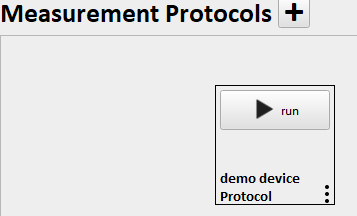\
This should build the protocol (converts your recipe to a python script that uses [Bluesky](https://blueskyproject.io/) to orchestrate the measurement) and run it; resulting in information about the run in the log on the right side of the window.\

This creates a HDF5 file in the location specified by the data saving location set in `Settings` and the user and sample name. This file contains all the read data and all the metadata known to CAMELS. With a simple HDF5 viewer like [H5web](https://h5web.panosc.eu/h5wasm) you can easily read and display the data.\
\
We can see that the `motorX` was set correctly to a value of 4.

[Back to the top](#0-table-of-contents)

---

### 2.3. Sweeping using a `For-loop`step
Start by creating a new Protocol by clicking the large ➕ symbol next to `Measurement Protocols`in the main window.
#### Create Steps
Create a `For Loop`step as the first step in the sequence.\
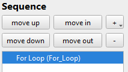

Right-click the `For loop`step and click `Add Into`to add a `Set Channel`step into the for-loop. Steps within a for-loop are executed for each iteration of the loop.\
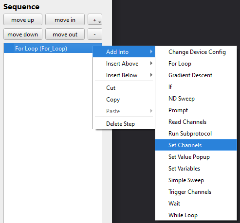\
Then also add a `Read Channel`step by right-clicking the `Set Channels`step and using _Insert Below_.\

#### Create Variables
> &#9888; This step is optional.

Add these variables to make it clearer what values are used in to for-loop. This also makes maintaining the protocol easier and enables you to more easily share it with others.   

#### Set Channels (using variables)
Start by setting the start, stop and number of points of the `For Loop`. To do this either simply type the number you want into the field or you can use the variables created above to set these parameters. To use the variables simply right-click the field and select `Insert Variable`and then `stop`. Like this for example:

When you entered the three relevant parameters you should see a list of points appear on the right side showing you which value the points you created will have.\
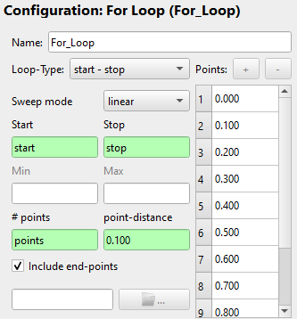

Now go to `Set Channels`and set the three motor channels of the `demo_device` to the value you want. For demonstration purposes we will set each channel to a function that uses either `For_Loop_Count` or `For_Loop_Value`. Where `Count` is the number of iteration of the for-loop; here for example it starts with `1` goes to `11`, increasing by `1` for each iteration. This can be used to count and keep track of your iterations. `Value` is the value belonging to the iteration count; here it would go from `0` to `1` in steps of `0.2`.   The name of these two variables changes if you rename the `for-loop`step to `<name_for_loop>_Count` and `<name_for_loop>_Value`.
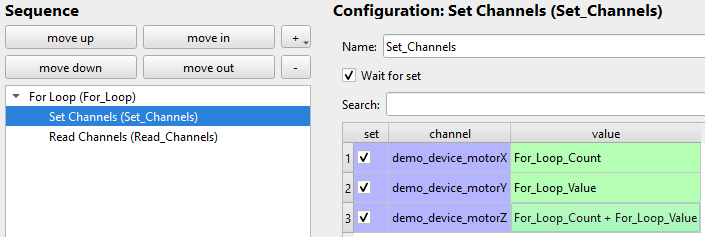\
We set 
- `motorX` to `For_Loop_Count`
- `motorY` to `For_Loop_Value`
- `motorZ` to `For_Loop_Count + For_Loop_Value`

to demonstrate both of the variables and the use of mathematical operations (here `+`) in value fields.

#### Read Channels
Now set which channels should be read each time the loop is iterated over. If you like you can simply select `Read All` at the top to read all available channels. You could of course select individual channels if you want read fewer. Here we are only interested in the motor channels, so we will only read these. 
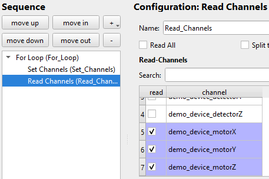

#### Run Sweep Protocol
Now simply click `OK` and `run` the protocol.
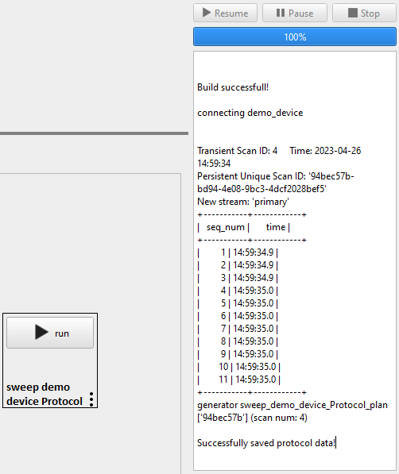\
You can already see the eleven iterations the loop makes from the console window.
#### Sweep Data
Now lets look at the data produced. The HDF5 file with the data is saved into the location specified by you. With a simple HDF5 viewer like [H5web](https://h5web.panosc.eu/h5wasm) you can easily read and display the data.

  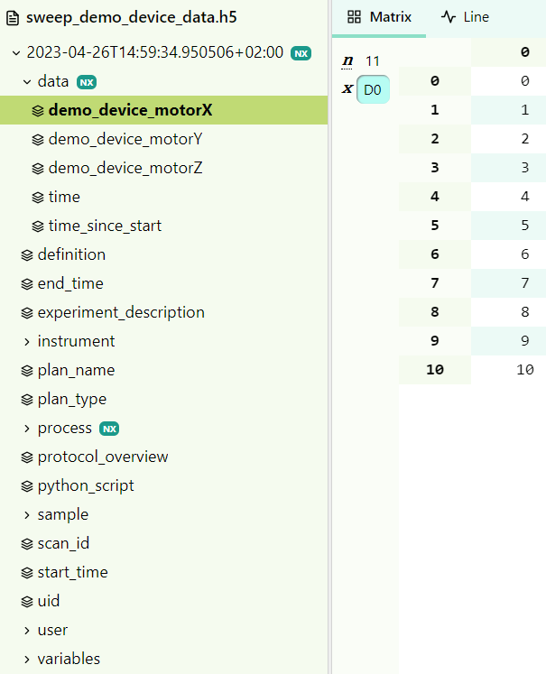

Here are the other two motor channels

  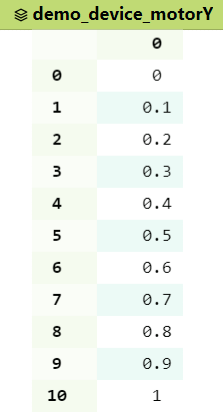
  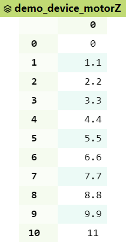 

We can see that the mathematical operation of adding `Count` and `Value` for `motorZ` worked.

[Back to the top](#0-table-of-contents)
### 2.4. Using the `Simple Sweep` functionality
If you want to sweep and set one channel (e.g. voltage) and read any number of other channels (e.g. current and temperature) you can either use a for-loop as described [above](#23-sweeping-using-a-for-loopstep) or you can use the _Simple Sweep_ functionality which is a 'cleaner' implementation of such a sweep.

#### Create Step
Start by creating a new Protocol by clicking the large ➕ symbol next to `Measurement Protocols`in the main window. Add a `Simple Sweep` step into teh sequence.
#### Customize Simple Sweep
You can now configure the `Simple Sweep`. This is quite similar to configuring the `for-loop` step [above](#23-sweeping-using-a-for-loopstep). But you musts first configure the Sweep Channel, so the channel that should be changed and set. We will use the `motorX` channel for this example.
\
`Data Output` configures in which Bluesky stream the sweep is run. `sub-stream` should be fine for most cases.\
Select the `Loop-Type` and `Sweep mode` you want. 

  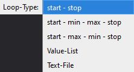
  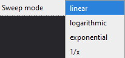 

Set the `Start`, `Stop` and `points` parameters. For this we can again use variables as done [above](#23-sweeping-using-a-for-loopstep). Then select which channels you want to read. We will only select the `motorX` channel. As this is the only channel that is changed.

  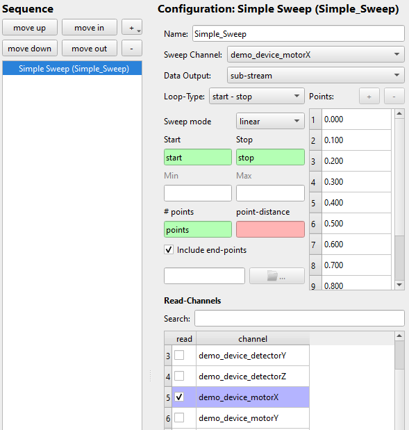

#### Run _Simple Sweep_
Click `OK` and `run` the protocol.\
\

#### Data File
Now lets look at the data produced. The HDF5 file with the data is saved into the location specified by you. With a simple HDF5 viewer like [H5web](https://h5web.panosc.eu/h5wasm) you can easily read and display the data.

  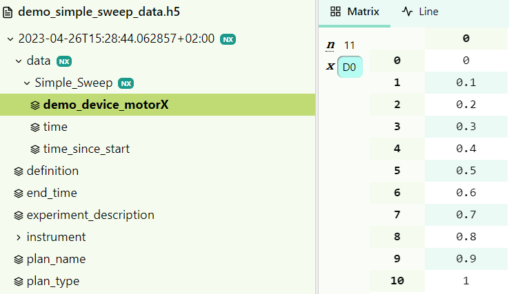

We can see that the set points of `motorX` are read successfully.

[Back to the top](#0-table-of-contents)
## 3. Manual Control
`Manual Control` allows you to set individual instrument channels (e.g. stage in x direction or a voltage output of a SMU)
### 3.1. Add Manual Control
To start simply click the &#10133; symbol next to `Manual Control`. You can now select which type of manual control you want to add. The options depend on the instruments you have installed. The most basic manual control is the `Stage_Control` which sets individual channels. It is mainly designed for motorized stages but can be used to control most instruments. 
### 3.2. Configure Manual Control
Select which axis the manual control should use. You must also select from which channel it should read the position (`readback axis`) . This is often the same channel as the `use axis`.
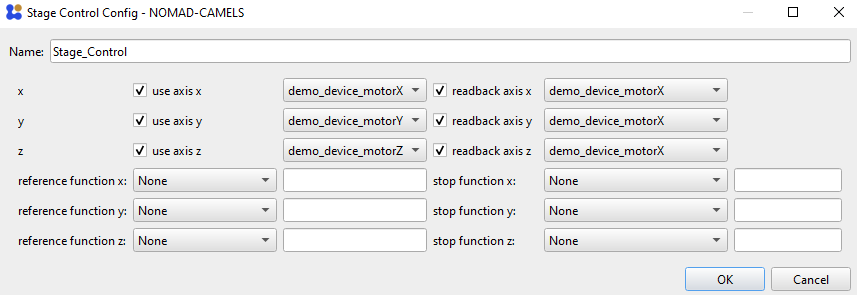

Click `OK` and `start` the manual control.\

This opens the stage control.\
\
Here you can set the step size and use the green arrow keys to control the selected axis. You can also jump to a specific value by using the `Go To` values.

  
  <a href="installation.html">&larr; Back</a>
  
  
    <a href="users_guide.html">Next &rarr;</a> 
  

