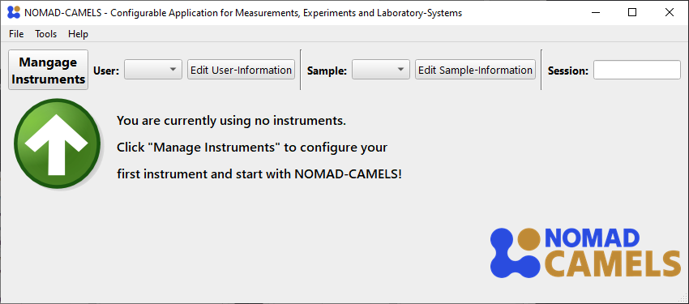

## Table of contents
{: .no_toc }

  

    Table of contents
  

  {: .text-delta }
- TOC
{:toc}

# Quick Start Guide
This guide should help you get to know the main functionalities of NOMAD-CAMELS (short: CAMELS) after a successful [installation](https://fau-lap.github.io/NOMAD-CAMELS/docs/installation.html).

## 1. Installing and Configuring Instruments
### 1.1. Installing Instruments
When you first start up NOMAD-CAMELS, you should see something like the following:  

Clicking on the "Manage Instruments" button will open a dialog where you can install available instruments from the CAMELS repository (PyPi).\
For this tutorial we use the "demo_device".

  
   

On the left we can see the instrument selection window. 
- Simply check the instruments you want to install. 
- Then click _Install / update Selected_ to install the most recent version of the instrument from PyPi via a simple `pip install <instrument_name>`

On the right you can see the screen after successful installation of the instruments. 

---

You can also filter the instruments by their name using the _Search name_ field as you see here in the right image.

    

### 1.2. Configuring Instruments

After successful installation you can switch to the "Configure Instruments" tab.\
Here all the available instruments are listed as well as the number of instances (so 'actual' instruments) you have added of the installed instrument type.\
For this simply select the instrument type you want to add and click the &#10133; symbol under _Configure_.

  
   

After adding the instrument a new instance of this instrument type is created. You can add as many instances of devices as you like by simply pushing the &#10133; symbol. This adds additional tabs with the _Custom name_ you gave the instrument. By default, the naming simply increments a number after the device name.

---

You can then change the instrument settings as you wish.\
You can also add a plain text description of the instrument and what you are planning to do with it. This is added to the metadata of your measurement when the instrument is used. This can help you better understand what the instrument does for larger project and allows others to better understand your measurement data.

  
   

---

When you are happy with the instruments settings and have added all the instruments required for your measurements you can simply click _OK_ to save all the instruments and settings to CAMELS.

# Using Instruments
After adding at least one instrument to CAMELS you now have two ways to control the instrument: 
1. [_Measurement Protocols_](#2-measurement-protocols)
2. [_Manual Control_](#3-manual-control)

## 2. Measurement Protocols
Measurement protocols are the main way in which CAMELS performs measurements. It can be understood as something similar to a _measurement recipe_ where a step for step guide is given to different instruments to perform a measurement procedure.

A good example of such a measurement procedure is a temperature dependant current-voltage (IV) measurement. Here the temperature of a sample is set to a specific value with a PID controller and waits for the temperature to be stable. Then it performs an IV-sweep, so it sets a voltage and measures the accompanying current for a given range of voltage values (often something like 100 points between -1 V and +1V).\
The temperature set-points are also varied to values in a given range (for example from 295K to 320K in 25 steps).\
So one would need to nest different loops (one for setting teh temperature and one for setting the voltage). This can be done quite simply using CAMELS.

### 2.1. Simple Start with _demo_device_
But let's start very simple with the _demo_device_ which is a pure software implementation of an instrument. 

Start by clicking the large &#10133; symbol next to _Measurement Protocols_. This opens up and empty protocol window.

Here you can fully configure the measurement routine you want to perform. Give the protocol a custom name using _Protocol Name_. With _Filename_ you set the name of data file that is created during the measurement. You can also add a custom description to describe what your measurement protocol does.

One key part of this window is the _Sequence_ element on the left.
Here you will configure the individual steps of the measurement procedure.

Simply right click into the empty space or use the small &#10133; symbol in the top right to add a new step. 

## 3. Manual Control

  
  <a href="installation.html">&larr; Back</a>
  
  
    <a href="users_guide.html">Next &rarr;</a> 
  

