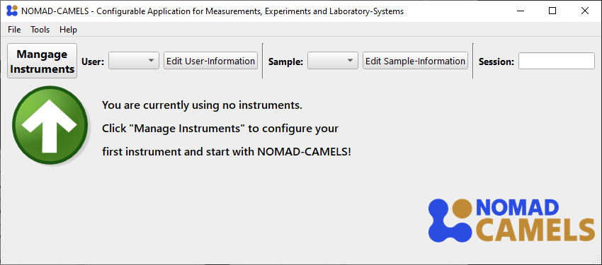
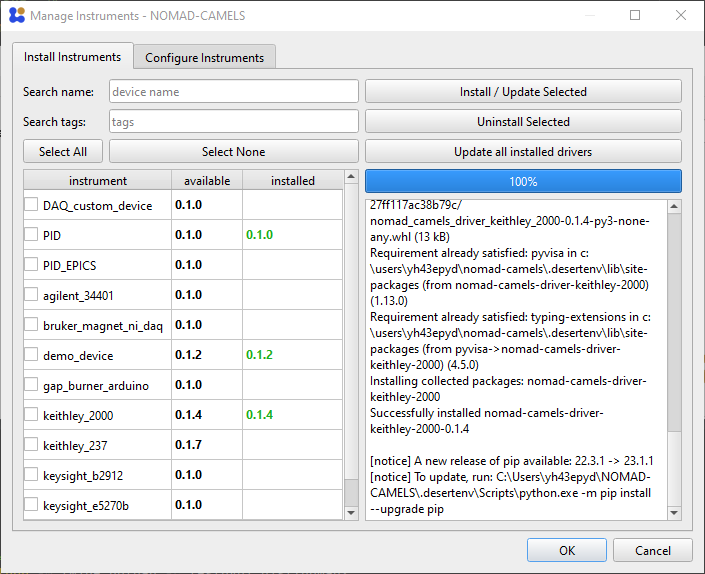
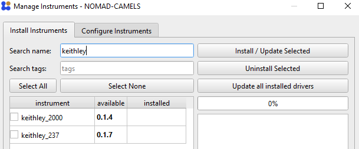
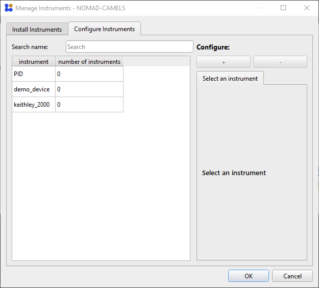
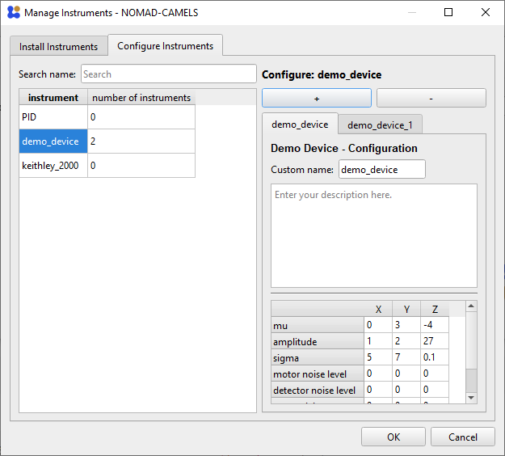
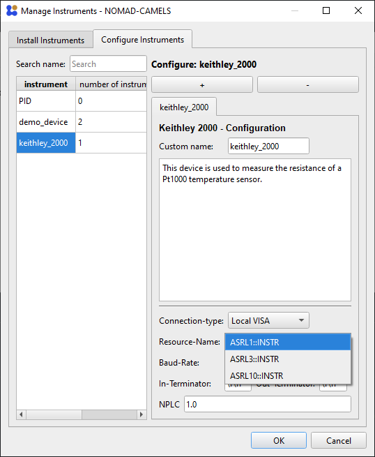

## Table of contents
{: .no_toc }

<details open markdown="block">
  <summary>
    Table of contents
  </summary>
  {: .text-delta }
- TOC
{:toc}
</details>


# 1. Installing and Configuring Instruments
This page should help you when using CAMELS for the first time. It shows you how to add (install) new instruments to CAMELS and how to configure them.
## 1.1. Installing Instruments
When you first start up NOMAD-CAMELS, you should see something like the following:  

Clicking on the "Manage Instruments" button will open a dialog where you can install available instruments from the CAMELS repository (PyPi).\
For this tutorial we use the "demo_device".

<p float="left">
  
   
</p>

On the left we can see the instrument selection window. 
- Simply check the instruments you want to install. To follow this example simply install the `demo device`. 
- Then click `Install / update Selected` to install the most recent version of the instrument from PyPi (this is done internally with a simple `pip install <instrument_name>`).

&#9888; This means you can also use the virtual python environment `.desertenv` to manually install devices by using 
```powershell
pip install --no-cache-dir --index-url https://test.pypi.org/simple/ --extra-index-url https://pypi.org/simple nomad_camels_driver_<parent_driver_name>
```

&#9888; For this to work you must activate the correct virtual environment first!
Run this code with the correct path in powershell to activate the virtual environment:
```powershell
cd \Path\to\NOMAD-CAMELS\.desertenv\Scripts\
.\activate
```

On the right you can see the screen after successful installation of the instruments. 

---



You can also filter the instruments by their name using the `Search name` field as you see here.

<br/><br/><br/><br/>

---

## 1.2. Configuring Instruments

After successful installation you can switch to the "Configure Instruments" tab.\
Here all the available instruments are listed as well as the number of instances (so 'actual' instruments) you have added of the installed instrument type.\
For this simply select the instrument type you want to add and click the &#10133; symbol under `Configure`.

<p float="left">
  
   
</p>

After adding the instrument a new instance of this instrument type is created. You can add as many instances of instruments as you like by simply pushing the &#10133; symbol. This adds additional tabs with the `Custom name` you gave the instrument. By default, the naming simply increments a number after the device name.

## 1.3 Change Instrument Settings
You can then change the instrument settings as you wish.\
You can add a plain text description of the instrument and what you are planning to do with it. This is added to the **metadata** of your measurement when the instrument is used. This can help you better understand what the instrument does for larger project and allows others to better understand your measurement data.

<p float="left">
  
   
</p>

---

When you are happy with the instruments settings and have added all the instruments required for your measurements you can simply click `OK` to save all the instruments and settings to CAMELS.


[&#8679; Back to the top &#8679;](#table-of-contents)
<p style="text-align:left;">
  <span style="color: grey;">
  <a href="quick_start.html">&larr; Back</a>
  </span>
  <span style="float:right;">
    <a href="quick_start_protocols.html">Next &rarr;</a><br>
  </span>
</p>