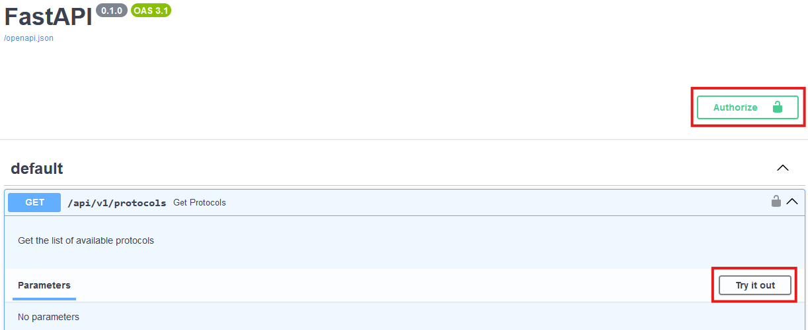
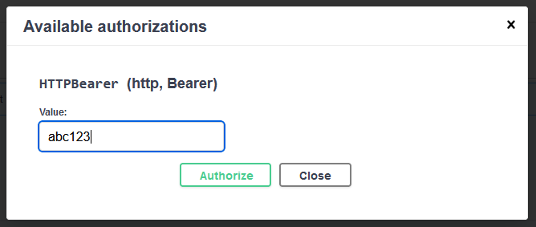

# Using the API (v1)

This page should help you use and understand the API and its functionality.

Make sure to check the automatic documentation under `//localhost:<port>/` or `//localhost:<port>/docs`. There you can also find more information on the request schemas and responses.

- [General Information](#general-information)
- [Most Useful Commands](#most-useful-commands)
- [Get Protocol Parameters](#get-protocol-parameters)
- [Executing Protocols](#executing-protocols)
- [Protocol Queue](#protocol-queue)
- [Protocol Results](#protocol-results)
- [Measurement Metadata](#measurement-metadata)

## General Information

The CAMELS API works by sending HTTP requests to its web server.

To use any request other than the home path of the web server you need to authenticate your request using the API key (see [Creating API Keys](Creating_API_Keys.md)).

If you are using a regular browser and want to use the API manually it is best to navigate to `<host>:<port>`. You can then select the request you want to perform and click on *Try it out* and then *Execute*.



You will be need to authenticate yourself to send any API requests. Simply enter the API key in the password section. The username can be anything or empty. This will look something like this



Once authorized in the browser you will stay authenticated when using further requests until you close the browser.


## Most Useful Commands

Bellow are descriptions for the most useful commands.

```{attention}
In the following all paths are given als relative paths from `//localhost:<port>/`.
```

## Get Protocol Parameters

Use these requests to find out which protocols exists and what variables each protocol has.

### GET: Get available Protocols

You can get all protocol names that are currently available  in CAMELS by going to

```bash
/api/v1/protocols
```

You can also use Python to perform the http request. This could look something like:

```python
import requests
api_key = "123abc" # Enter the actual API key you got from CAMELS here
# Create the headers with the Bearer token
headers = {
    "Authorization": f"Bearer {api_key}"
}
port = 5000 # Change this to the port you are acutally using
result = requests.get(f"http://localhost:{port}/api/v1/protocols", headers=headers)
```

The API will return a JSON string of the form:

```JSON
{"Protocols":["ProtocolXYZ","DefaultProtocol","..."]}
```

### GET: Protocol Variables

Get the changeable variables of a protocol:

```bash
/api/v1/protocols/variables/{protocol_name}
```

## Executing Protocols

Every time you execute a protocol via the API a unique identifier (UUID) is generated and a URL is returned where you can check on the current status of that protocol.
The UUID is saved together with the current *run status* to the SQLite database file `CAMELS_API.db` under `protocol_run_status`.

The status can either be `currently in queue`, `currently running` or the file path to the data if the protocol finished.

If you go to the URL returned by the request, for example:

```JSON
{
  "check protocol status here": "/api/v1/protocols/results/ae593c12-8938-4e24-b05b-77c169f10f76"
}
```

and the protocol is finished you will be able to get the path to the measurement file under `status`:

```JSON
{
    "uuid":"ae593c12-8938-4e24-b05b-77c169f10f76",
    "status":"C:\\Users\\User\\Documents\\NOMAD_CAMELS_data\\default_user\\default_sample\\data_2024-08-08T14-26-13.848567+02-00.nxs"
}
```

There are two ways you can directly **execute** a protocol you defined in CAMELS via the API:

- [GET Protocols](#get-run-protocols)
- [POST Protocols](#post-run-protocols-with-variables).

If you want to queue protocols see [here](#protocol-queue) for more information.

### GET: Run Protocols

```{note}
`GET` requests can be performed using a regular browser by entering the URL below.
``` 

```bash
GET /api/v1/actions/run/protocols/{protocol_name}
```

This will directly execute the Protocol with the name `protocol_name`.

This is equivalent to pressing the `run`-button on a protocol.

In response to the request, you will receive the UUID, which allows you to track the current state of the protocol. See [Executing Protocls](#executing-protocols) or [Protocol Results](#protocol-results) for more information on protocol status.


### POST: Run Protocols with Variables

```{note}
`POST` requests can **NOT** be performed using a regular browser.
``` 

```bash
POST /api/v1/actions/run/protocols/{protocol_name}
```

```python
body: {
  "variables": {
    "key1": "value1",
    "key2": "value2"
  }
}
```

You can modify variables that are defined in the protocol and then execute the protocol with the newly defined variables.

To do this you must change the `"key1"` to match the variable name and the `"value1"` to the desired value.

For a protocol like this


You could use a body like

```python
body: {
  "variables": {
    "points": 21,
    "start_stop": 7
  }
}
```

Using Python this could look like this

```python
api_key = '123'
protocol_name = 'demo'
data = {'variables': {'start_stop': 10, 'points': 31}}
# convert data to json
data_json = json.dumps(data)
# %%
result = requests.post(
    f"http://127.0.0.1:5000/api/v1/actions/run/protocols/{protocol_name}",
    auth=("", f"{api_key}"),
    json=data
)
```

In response to the request, you will receive the UUID, which allows you to track the current state of the protocol.

## Protocol Queue

There is protocol queue that allows you to create a list of protocols that are executed after each other.

There are two ways you can add a protocol to the queue either "as-is" so the same as pushing the green "queue" button or you can again modify the variables.

### GET: Add Protocol to Queue

```bash
/api/v1/actions/queue/protocols/{protocol_name}
```

In response to the request, you will receive the UUID, which allows you to track the current state of the protocol.

The status can either be `currently in queue`, `currently running` or the file path to the data.

### POST: Add Protocol to Queue and Change Variables

```bash
/api/v1/actions/run/protocols/{protocol_name}
```

```python
body: {
  "variables": {
    "points": 21,
    "start_stop": 7
  }
}
```

In response to the request, you will receive the UUID, which allows you to track the current state of the protocol.

The status can either be `currently in queue`, `currently running` or the file path to the data.

### POST: Change Variables of Protocol in Queue

If you already added a protocol to the queue but want to change its variables afterwards you can use this request.

```bash
/api/v1/actions/queue/variables/protocols/{protocol_name}_{index}
```

```python
body: {
  "variables": {
    "points": 21,
    "start_stop": 7
  }
}
```

Again give the name of the protocol (for example `demo`) and the index of where it is in the queue. The index starts with 0 for the first (top-most) protocol.

```{note}
You can also use -1 to access the last element. 
```

In Python this can look like this

```python
protocol_name = 'demo'
index = 0
data = {'variables': {'start_stop': 10, 'points': 31}}
result = requests.post(
    f"http://127.0.0.1:5000/api/v1/actions/queue/variables/protocols/{protocol_name}_{index}",
    auth=("", f"{api_key}"),
    json=data,
)
```

### GET: Protocol Ready

When checking the `ready` button in the queue the protocol will be execuited if it is the first in the row. This allows you to chain several protocols and run them consecutively.

To check a protocol with the API use

```bash
/api/v1/actions/queue/ready/protocols/{protocol_name}_{index}
```

Again give the name of the protocol (for example `demo`) and the index of where it is in the queue. The index starts with 0 for the first (top-most) protocol.

### GET: Get Current Protocol Queue

To get the current protocol queue list use

```bash
/api/v1/queue
```

### GET: Remove Protocol from Queue

To remove a protocol from the current queue use

```bash
/api/v1/actions/queue/remove/protocols/{protocol_name}_{index}
```

Again give the name of the protocol (for example `demo`) and the index of where it is in the queue. The index starts with 0 for the first (top-most) protocol.

## Protocol Results

Every protocol run will generate data. Either into a single file or individual HDF5 files for each measurement. You can check the current status of the measurement using the command found [bellow](#protocol-results-file-path).

To be able to retrieve the results of a protocol run via the API you can either get the [file path](#protocol-results-file-path) for the data file created or get the [actual file](#protocol-results-file).

```{warning}
Retrieving the actual data file can crash for large files. Only do this if you are sure that the file is small enough to be handled by your RAM and browser.
```

### Protocol Results File Path

To get the file path to where the data is stored use

```bash
/api/v1/protocols/results/{protocol_uuid}
```

If the protocol is still in the queue or is not finished yet it will return `currently in queue` or `currently running` respectively.

### Protocol Results File

To get the actual file use

```shell
/api/v1/protocols/results/{protocol_uuid}/file
```

If the protocol is still in the queue or is not finished yet it will display `currently in queue` or `currently running` respectively.

## Measurement Metadata

You can get and modify the measurements metadata like the *user* performing the measurement, the *sample* used or a *session name* to better describe what you are doing. 

### GET: Samples

You can get all the available samples using

```shell
/api/v1/samples
```

### GET: Set Sample

You can set the current sample by using

```shell
/api/v1/actions/set/samples/{sample_name}
```

### GET: Users

You can get all the available users using

```shell
/api/v1/users
```

### GET: Set User

You can set the current user by using

```shell
/api/v1/actions/set/users/{user_name}
```

### GET: Session Description

You can get the current session description by using

```shell
/api/v1/session
```

### GET: Set Session Description

You can set the current session description by using

```shell
/api/v1/actions/set/session/{session_name}
```
