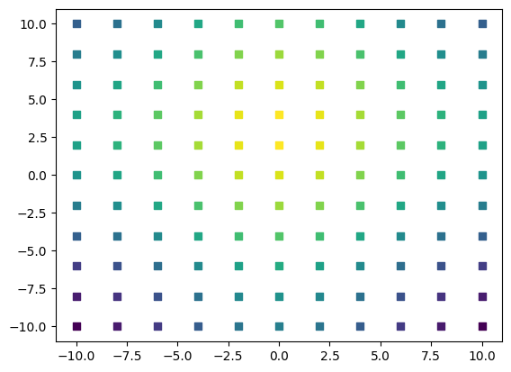

# HDF5 files / Data Evaluation

## Display HDF5 File

You can  display the HDF5 file you obtained from CAMELS by dragging-and-dropping it into the h5 group's [web viewer](https://myhdf5.hdfgroup.org/) or any other HDF5-viewer.

## Using the NOMAD CAMELS toolbox

```{hint}
We try to provide the most often necessary steps for data evaluation in our toolbox. We recommend using the toolbox. For more information, [see the toolbox documentation](nomad_camels_toolbox.md#nomad-camels-toolbox)
```

## Using h5py

```{note}
For most data, we provide a more convinient way to handle the data, see the [NOMAD CAMELS toolbox](#nomad-camels-toolbox).
```

```{warning}
This section uses older versions of the CAMELS data structure and may be deprecated in some parts. The concepts about Using h5py are still valid.
```

### Reading HDF5 Files from CAMELS

You can read a measurement file using the Python **h5py** package.

To work with your data in Python run

```python
import h5py
f = h5py.File('mytestfile.hdf5', 'r')
```

You can access the contents of the HDF5 file just like a dictionary.


### Navigate the File

Here is an example how you can navigate the HDF5 file.

```python
import h5py
f = h5py.File("data.h5", 'r')
all_measurement_keys = list(f.keys()) # List of all the measurements that were performed

# Pick a single measurement
measurement = f['2023-12-01T10:47:44.718633+01:00']
keys_measurement = list(measurement.keys()) # List of all the entries to this measurement

# Pick a single data set
data = measurement['data']
data_keys = list(data.keys()) # List of all the channels that were read

# Get the data of a single channel you read
detector_data = data['demo_instrument_detectorComm']
motorx_data = data['demo_instrument_motorX']
motory_data = data['demo_instrument_motorY']
# These HDF5 datasets act very similar to ndarrays
# And can be used very similar to any np.array
```


### Create Data Plots

This is how you can create a 2D-plot from a detector where the motor was moved in x and y direction and for each position the detector was read

```python
import h5py
import matplotlib.pyplot as plt

f = h5py.File("data.h5", 'r')
all_measurement_keys = list(f.keys()) # List of all the measurements that were performed

# Pick a single measurement
measurement = f['2023-12-01T10:47:44.718633+01:00']
keys_measurement = list(measurement.keys()) # List of all the entries to this measurement

# Pick a single data set
data = measurement['data']
data_keys = list(data.keys()) # List of all the channels that were read

# Get the data of a single channel you read
detector_data = data['demo_instrument_detectorComm']
motorx_data = data['demo_instrument_motorX']
motory_data = data['demo_instrument_motorY']
# These HDF5 datasets act very similar to ndarrays
# And can be used very similar to any np.array

for index, detector_data_point in enumerate(detector_data):
    plt.scatter(motorx_data[index], 
                motory_data[index] , 
                c=detector_data_point, 
                marker=',' ,
                cmap='viridis', 
                vmin=min(detector_data), 
                vmax=max(detector_data)
                )
```




### Get Metadata

Navigate the file like a Python dictionary to get the desired metadata:

#### Protocol Overview and Python Script

To get the protocol overview of the performed measurement run 

```python
import h5py
import matplotlib.pyplot as plt

f = h5py.File("data.h5", 'r')
all_measurement_keys = list(f.keys()) # List of all the measurements that were performed

# Pick a single measurement
measurement = f['2023-12-01T10:47:44.718633+01:00']

# The strings are saved as UTF-8 encoded bytes
protocol_overview = measurement['protocol_overview'][()].decode('utf-8')
print(protocol_overview)
```

To get the Python script of the performed measurement run 

```python
python_script = measurement['python_script'][()].decode('utf-8')
print(python_script)
```

#### Instrument Settings

All instrument settings are found in `measurement/instrument/environment/<instrument_name>`. You can then list the saved meta data of a single instrument if you run

```python
meta_data_demo_instrument = measurement['instrument']['environment']['demo_instrument']
meta_data_demo_instrument_keys = list(meta_data_demo_instrument.keys())
print(meta_data_demo_instrument_keys)
... ['model', 'name', 'settings', 'short_name']
```

To list all the actual settings entered in the `Manage Instruments` window run

```python
list(meta_data_demo_instrument['settings'].keys())
... ['amps',
    'description',
    'detector_noises',
    'motor_noises',
    'mus',
    'set_delays',
    'sigmas',
    'system_delays'
    ]
# Get the gaussian line widths (sigma) of the demo_instrument
meta_data_demo_instrument['settings']['sigmas'][()]
... array([5. , 7. , 0.1])
```


### Convert the full HDF5 File to Python Dictionary
You can use this Python script to read your HDF5 recursively and convert it to a nested dictionary.

```{note}
This is typically not necessary as the HDF5 file can be used like a dictionary in Python but might be useful in some situations.
```

```python
import h5py


def h5_to_dict(h5file):
    def h5_to_dict_rec(h5group):
        d = {}
        for key, item in h5group.items():
            if isinstance(item, h5py.Dataset):
                d[key] = item[()]
            elif isinstance(item, h5py.Group):
                d[key] = h5_to_dict_rec(item)
        return d
    with h5py.File(h5file, 'r') as f:
        return h5_to_dict_rec(f)


# Example usage:
data = h5_to_dict(r'C:\Users\file.h5')
```

Then  access the relevant data by navigating through the dictionary.

