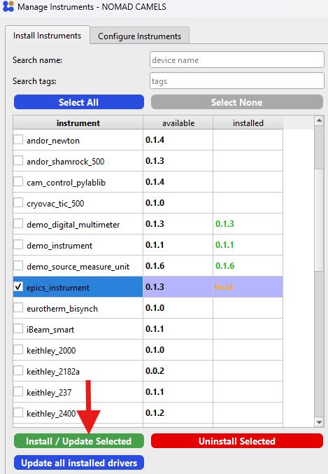
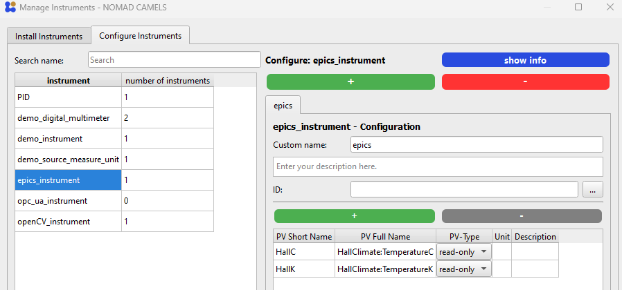

# EPICS instrument-drivers
```{note}
There are two ways you can use your existing EPICS infrastructure (records/signals) using CAMELS:
1. Use the generic EPICS instrument to group and control any number of EPICS signals. **Requires no additional coding!**
2. Create your own custom EPICS instrument driver using the our Instrument Driver Builder
```

## 1. Generic EPICS Instrument

The easiest way to control your EPICS infrastructure is using the already existing `EPICS Instrument`.

1. Go to `Manage Instruments` -> `Install Instruments`
2. Select `epics_instrument` and install it
   
3. Under `Manage Instruments` you can now add instances of EPICS instruments and add PVs to each instrument by simply writing their full PV path into the `PV Full Name` field (e.g. `S:MPS:srBeamCurrentCC`).
   

Make sure to select the correct type of PV: Either `read-only` or `set` depending on if you only want to read the PV or actually change its value.

If you need a more fine-grained approach and more control over what is being done you can also write your own driver as explained below.

## 2. Custom EPICS Instrument Driver

To make new CAMELS drivers for your EPICS environment it is easiest to use the `EPICS-driver-builder` that you can find in CAMELS under `Tools` in the top-bar.

### How to use the builder

You can use the driver-builder as follows:

- __Instrument Name:__ This will be the `<instrument_driver_name>` of your instrument in CAMELS.
- __Input Channels:__ These are the PV-names that are later listed as read-only channels in CAMELS
- __Output Channels:__ List the PV-names you want to use as writable channels
- __Config Channels - Read Only:__ These PVs are for configuration that usually needs to be read only once. An example could be the identity of a measurement instrument.
- __Config Channels:__ These are the PVs that will configure the instrument in the beginning of the measurement. Here, you also need to give a datatype for the PV (float, string or bool), which will be used to generate the UI in the instrument configuration.

When you click on "Build Driver", a folder named `nomad_camels_driver_<instrument_driver_name>` should appear in the specified path (either you are asked when the build is done, or it is your local driver path, specified in the program's settings).  
The folder should contain two files `<instrument_driver_name>.py` and `<instrument_driver_name>_ophyd.py`.

The resulting PV-names will in the end be `<instrument_name>:<PV-name>` where:

- `<instrument_name>` is the name you give your instrument in the config inside CAMELS. This will appear in the manage instruments window.
- `<PV-name>` is the name you give the PVs in the builder. You can also see them in the `<instrument_driver_name>_ophyd.py`-file.

```{note}
 There are two things you need to pay attention to:
- The `<instrument_driver_name>` you use in the builder must __NOT__ be equal to the name of your instrument later.
- The `<PV-name>` should not mirror any python builtin function. If your EPICS environment uses such a name, you can edit the file (see **Troubleshooting**)
```

## Troubleshooting

If a PV in your EPICS environment has a name matching built-in Python functions and types as well as predefined Python keywords e.g. you have a PV  called `set`, you might must modify this in your driver:

```python
set = Cpt(EpicsSignal, "set") # This does not work!
```

Since `set` is a builtin function, this will not work. Instead you can break the convention of bluesky / ophyd that the components and PVs should have the same name and change the variable name like this:

```python
setter = Cpt(EpicsSignal, "set") # This works
```
