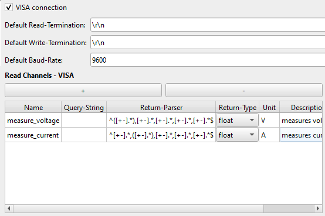

# Tutorial - Creating your own Instrument Driver

In this tutorial we want to guide you through the process of creating a new driver for an instrument you have in your lab.

The instrument we want to implement is a _Keithley Series 2400 SourceMeter_.
The instrument is connected to our computer via serial connection (RS232, GPIB, ...).

## 1. Create the Core Structure

To create the core structure use the _driver builder_. Open `CAMELS` and navigate to `Tools > Driver builder`.


## 2. Name Instrument

1. Fill out the `Name` field to name the instrument.\
   The name should be all lower-case and should make clear what instrument this driver is for. The name should start with an alphabetical letter [a-z], as the name entered here will become a Python variable.\
   In our case we will use `keithley_2400_smu`.
2. The `Ophyd-Class-Name` should be the same as `Name` but with the first letter in uppercase. This is best-practice, in general you can use any class name you want.\
   So here we choose `Keithley_2400_smu`.
   In later versions the ophyd-class-name is given automatically.

## 3. Select VISA Connection

Now you must choose if the instrument uses a serial connection like GPIB, RS232, ... and can be communicated with via the VISA protocol.\
Check or uncheck the `VISA connection` box accordingly.

As our Keithley instrument is connected using a GPIB-USB adapter we check the `VISA connection` box.

The driver builder sohuld now look like this


## 4. Set Serial Connection Parameters (OPTIONAL)

If you use a instrument with serial communication you should now set the terminators and the baud rate. Make sure this matches the instrument setting of the physical hardware device.

Our instrument uses the default settings, so we can just leave this. You can always change these values later on in the instrument manager when actually adding the instrument.

## 5. Adding Channels

The core part of the drivers are the channels you define for each instrument. Each channel corresponds to one action or value (this can be a single value or something more complex like an n-dimensional array) you want to set or read.

Think of the actions you want to perform with your instrument and then add a channel for each.

We want to add the functionality to read and set voltages, as well as currents.
We also want to be able to configure some instrument settings such as the compliance (maximum allowed output) and the ranges for voltage and current.

We will start with the reading and setting of voltages and currents.

### 5.1 Reading and Setting - VISA

As we want to actually communicate with the instrument when setting and reading it, we add these as

- `Read Channels - VISA`: reading the voltage/current values measured by the instrument.
- `Set Channels - VISA`: sets voltage/current on the instrument.

```{important}
`VISA` channels **always** send a string to the instrument. If you do not want to send a string every time the channel is set or read, use the custom Channel on the left! There you can customize exactly waht is done when the channel is read and set.
```

### 5.2 Reading Channels - VISA

We now add two `Read Channels - VISA` by clicking the &#10133;Symbol.
The Keithley 2400 only as a `READ?` command which reads voltage or current depending on the measurement type selected by the command `:CONF:<VOLT/CURR>` so we can not send a genereic read command to the instrument. Therefore, we leave the `Query-string` field empty. We will add the functionality to actually read values from the instrument after the driver has been built by adding a few lines of Python code to the driver.

As we know how the read data looks like we can add a return parser that takes the answer from the instrument and uses regex matching to extract the exact value we are looking for. The regular expression we use to parse the response:

```regexp
Voltage:
^([+-].*),[+-].*,[+-].*,[+-].*,[+-].*$
Current:
^[+-].*,([+-].*),[+-].*,[+-].*,[+-].*$
```

the braces are the actual value that is taken. (1. match group of the expression)

We want the voltage and current to be read in as a float, so we select `float` in the `Return-Type` field.

For a detailed description of the possible fields see  [here](../../programmers_guide/drivers/writing_drivers.md#channel-fields).

As unit we set `V` and `A` respectively.

You can add a `Description` if you like. This will make it easier for people to understand what this channel does and how to use it in a measurement protocol. Descriptions appear when overing over a channel in the measurement protocol.

Your instrument should look something like this now.


### 5.3 Set Channels - VISA

We now add two `Set Channels - VISA` by clicking the &#10133;Symbol.

The Keithley 2400 can only set voltages/currents if the source function is set to voltage/current. This means we can not send a generic command to simply set the voltage/current of the output but we have to check if it is in the right source mode first. Therefore, we can not add a generic `Write-Format-String` but we will add the functionality later on in the Python code of the driver.

We add units and descriptions. You should have something like this now


### 5.4 Instrument Settings

Now we want to add channels that will define the instrument settings, so things that typically do not change for an instrument during a single measurement. These channels are executed at the beginning of every protocol. For the Keithley 2400 this is:

- Voltage/current compliance
- Voltage/current range (accuracy is about 0.01% of the selected range)

We will first add the setting options for the compliances.

```{attention}
You have to manually add default values for the settings you create here after the driver has been built! Modify the `keithley_2400_smu.py` to do this. See [below](chapter_9) for more information.
```

#### 5.4.1 Compliances

As the instrument takes a simple `:CURR/VOLT:PROT <value>` command to set the instrument compliance we can send this command without further modification. 

We add a regular `Config Channel - VISA` entry by clicking the &#10133;Symbol. 

Then we enter a `Write-Format-String` which defines what is done when the channel is set. The setting of a settings channel always occurs at the beginning of the protocol execution. We enter

```
:VOLT:PROT {value}
```

for the voltage channel and

```
:CURR:PROT {value}
```

for the current channel.

Then we add the units and a short description. You should now have the following entry for your instrument.


#### 5.4.2 Ranges

We can proceed in the same way for the voltage/current ranges. The voltage and current can be regulated with a precision of 0.01% of the given range.

We add two new channels and add the command for setting the range in the `Write-Format-String` field like:

```
:VOLT:RANG {value}
```
After adding units and a description you should now have the following settings channels:


We do not need return parser, as we do not want to read any thing from these channels when setting them.

#### 5.4.3 Instrument ID

For the last channel we want to read the instrument ID at the start of every protocol execution. Here we want to send the `*IDN?` command and read the string that is returned. As this command takes no variable parameters we can add this as a simple `Config Channels - Read Only - VISA` channel.

We expect the returned value to be a string and we do not require any parsing as we just want the entire string. 

You should now have the following Read Only configuration channel:


## 6. Build the Driver

We can now build the driver. This will create the folder structure as well as the required python files.

For this simply hit `Build Driver` and select a location where the driver should be saved. You should now have a folder with the following structure.

```
keithley_2400_smu
└─> nomad_camels_driver_keithley_2400_smu
    └─> keithley_2400_smu.py
    └─> keithley_2400_smu_ophyd.py
└─> LICENSE.txt
└─> pyproject.toml
└─> README.md
```

```{important}
The standard license that is created with the builder is LGPL 2.1. This is a permissive license. 
If you do not want this, you must manually remove or change the license!
This is only relevant if you choose to share your driver with others.
```

The `pyproject.toml`, `LICENSE.txt` and `README.md` files are created to make it easier for you to share your driver with others. It is only a few more [steps](pypi_drivers.md) to upload your driver to PyPI.

As CAMELS is an open-source project by and for the community you can share your driver with others. Find out more about sharing your driver [here](pypi_drivers.md).

## 7. Modify Driver Files - Adding Functionality: Reading and Setting

We now want to add the functionality for setting and reading the voltage and current. For this we have to modify the python files that we just created.

The device communication and channel definitions are in the `*_ophyd.py` file. The settings channels are also defined here, but the GUI settings are found in the `*.py` file.

### 7.1 Adding Read Functionality
Open the `keithley_2400_smu_ophyd.py` file.

You can see that there are already four empty functions defined:

```python
def measure_voltage_query_function(self):
   pass

def measure_current_query_function(self):
   pass

def set_voltage_write_function(self, value):
   pass

def set_current_write_function(self, value):
   pass
```

All we have to do now is modify these functions to achieve the desired result.

To prevent the instrument from trying to connect or communicate on startup add this line after the `.write` and `.query` definitions:

```python
if name == 'test':
   return
```

All code below this will not be executed when CAMELS starts up.
 You should now have 

 ```python
...
   self.set_voltage.write = self.set_voltage_write_function
   self.set_current.write = self.set_current_write_function
   if name == 'test':
      return
 ```

As we want our driver to remember what reading and setting mode he is in, we will add variables to the driver which we can then change as needed:

```python
self.source_function = None
self.measure_function = None
self.output_on = False
```

To read the voltage we first want to check if the instrument is in voltage reading mode. If it is not we want to change to a voltage reading mode else we simply want to read. The `.query` method always expects a string to be returned which it then writes to the instrument. Therefore all the functions return simple strings that are created every time the function is called. This leads to the following code for the `measure_voltage_query_function`:

```python
def measure_voltage_query_function(self):
   if self.measure_function != 'voltage':
      self.visa_instrument.write(':CONF:VOLT')
      self.measure_function = 'voltage'
   else:
      pass
   return ':READ?'
```

we do the same for the current reading:

```python
def measure_current_query_function(self):
   if self.measure_function != 'current':
      self.visa_instrument.write(':CONF:CURR') # Sets the correct measurement mode
      self.measure_function = 'current'
   else:
      pass
   return ':READ?'
```

````{important}
The 
```python
self.visa_instrument.write() 
```
function can be used to send string visa commands directly to the instrument. This is very useful when you need to send a sequence of several commands when executing a single action. This also allows you to write specific commands to the device before sending the final command by returning a string to the .write or .query methods.
````


### 7.2 Adding Setting Functionality

We proceed in similar fashion for the setting of voltages and currents. Here we also first want to check what source mode we are in and change the mode if does not match. Then we check if the output is on and if not we turn it on. The `.write` method always expects a string to be returned which it then writes to the instrument. Therefore all the functions return simple strings that are created every time the function is called.

```{Note}
This means that setting the voltage and current **ALWAYS** turns on the output! Consider this when designing your protocols and care for everyone's safety. 
```
Finally we set the value resulting in the following code for setting voltages

```python
def set_voltage_write_function(self, value):
   if self.source_function != 'voltage':
      self.visa_instrument.write(':SOUR:FUNC VOLT') # Setst the correct source mode
      self.source_function = 'voltage'
   else:
      pass
   if self.output_on:
      pass
   else:
      self.visa_instrument.write(':OUTP 1') # Turns on output
   return f':SOUR:VOLT {value}'
```

The final driver looks as follows

<details>
  <summary>Full Keithley 2400 driver</summary>

```python
from ophyd import Component as Cpt

from nomad_camels.bluesky_handling.custom_function_signal import Custom_Function_Signal, Custom_Function_SignalRO
from nomad_camels.bluesky_handling.visa_signal import VISA_Signal, VISA_Signal_RO, VISA_Device

class Keithley_2400_smu(VISA_Device):
	measure_voltage = Cpt(VISA_Signal_RO, name="measure_voltage", parse="^([+-].*),[+-].*,[+-].*,[+-].*,[+-].*$", parse_return_type="float", metadata={"units": "V", "description": "measures voltage"})
	measure_current = Cpt(VISA_Signal_RO, name="measure_current", parse="^[+-].*,([+-].*),[+-].*,[+-].*,[+-].*$", parse_return_type="float", metadata={"units": "A", "description": "measures current"})
	set_voltage = Cpt(VISA_Signal, name="set_voltage", parse_return_type=None, metadata={"units": "V", "description": "Sets voltage to desired value"})
	set_current = Cpt(VISA_Signal, name="set_current", parse_return_type=None, metadata={"units": "A", "description": "Sets current to desired value"})
	voltage_compliance = Cpt(VISA_Signal, name="voltage_compliance", write=":VOLT:PROT {value}", parse_return_type=None, kind="config", metadata={"units": "V", "description": "Sets the voltage compliance"})
	current_compliance = Cpt(VISA_Signal, name="current_compliance", write=":CURR:PROT {value}", parse_return_type=None, kind="config", metadata={"units": "A", "description": "Sets the current compliance"})
	voltage_range = Cpt(VISA_Signal, name="voltage_range", write=":VOLT:RANG {value}", parse_return_type=None, kind="config", metadata={"units": "V", "description": "Sets the voltage range"})
	current_range = Cpt(VISA_Signal, name="current_range", write=":CURR:RANG {value}", parse_return_type=None, kind="config", metadata={"units": "A", "description": "Sets the current range"})
	instrument_id = Cpt(VISA_Signal_RO, name="instrument_id", query="*IDN?", parse_return_type="str", kind="config", metadata={"units": "", "description": "Instrument id returned with *IDN? command "})

	def __init__(self, prefix="", *, name, kind=None, read_attrs=None, configuration_attrs=None, parent=None, resource_name="", write_termination="\r\n", read_termination="\r\n", baud_rate=9600, **kwargs):
		super().__init__(prefix=prefix, name=name, kind=kind, read_attrs=read_attrs, configuration_attrs=configuration_attrs, parent=parent, resource_name=resource_name, baud_rate=baud_rate, read_termination=read_termination, write_termination=write_termination, **kwargs)
		self.measure_voltage.query = self.measure_voltage_query_function
		self.measure_current.query = self.measure_current_query_function
		self.set_voltage.write = self.set_voltage_write_function
		self.set_current.write = self.set_current_write_function
		if name == 'test':
			return
		self.source_function = None
		self.measure_function = None
		self.output_on = False

	def measure_voltage_query_function(self):
		if self.measure_function != 'voltage':
			self.visa_instrument.write(':CONF:VOLT')
			self.measure_function = 'voltage'
		else:
			pass
		return ':READ?'

	def measure_current_query_function(self):
		if self.measure_function != 'current':
			self.visa_instrument.write(':CONF:CURR')
			self.measure_function = 'current'
		else:
			pass
		return ':READ?'

	def set_voltage_write_function(self, value):
		if self.source_function != 'voltage':
			self.visa_instrument.write(':SOUR:FUNC VOLT')
			self.source_function = 'voltage'
		else:
			pass
		if self.output_on:
			pass
		else:
			self.visa_instrument.write(':OUTP 1')
		return f':SOUR:VOLT {value}'

	def set_current_write_function(self, value):
		if self.source_function != 'current':
			self.visa_instrument.write(':SOUR:FUNC CURR')
			self.source_function = 'current'
		else:
			pass
		if self.output_on:
			pass
		else:
			self.visa_instrument.write(':OUTP 1')
		return f':SOUR:CURR {value}'
```
</details>

## 8. Instrument Clean Up - Protocol End

Some instruments might require specific commands to be sent before closing the connection or before they can be turned off. Right before a protocol ends, as a last step, the `finalize_steps` function is called.

As we turn on on the output when setting channels, we want the output to be turned off when the protocol ends, to prevent us from leaving the output on with a high voltage being sourced. We add the following code

```python
def finalize_steps(self):
   self.visa_instrument.write('OUTP 0')
```

This will always turn off the instrument after the measurement protocol is finished.

(chapter_9)=
## 9. Finishing the Instrument Settings

To modify your instrument settings open the `keithley_2400_smu.py` file. You must add a few more lines to finish the instrument settings so that they are displayed correctly in the instrument manager.
First add default values for the four settings channels.

```python
...
self.config["current_compliance"] = 0.1
self.config["voltage_compliance"] = 2
self.config["voltage_range"] = 2
self.config["current_range"] = 0.1
...
```

Now we can add labels for the channels so that we have a GUI that looks better. For this we simply add a dictionary of labels with the names of the channels as key and the corresponding value is the String we want displayed. Then pass the label dictionary to the `super().__init__` with the `labels=labels` command.

```python
...
class subclass_config(device_class.Simple_Config):
    def __init__(self, parent=None, data="", settings_dict=None, config_dict=None, additional_info=None):
        labels = {'current_compliance': 'Current Compliance (A)',
                  'voltage_compliance': 'Voltage Compliance (V)',
                  'voltage_range': 'Voltage Range (V)',
                  'current_range': 'Current Range (A)',
                  }
        super().__init__(parent, "keithley_2400_smu", data, settings_dict, config_dict, additional_info, labels=labels)
        self.comboBox_connection_type.addItem("Local VISA")
        self.load_settings()
```

## 10. Adding Your New Instrument
You should now be finished and ready to use the instrument. CAMELS loads locally stored drivers every time it is started from the path given in the CAMELS settings marked in red in the image below.


If every thing worked correctly you should see it when opening the `Instrument Manager` in the `Configure Instruments` tab. 


Now add the instrument with the &#10133;Symbol. We can now see the instrument settings that we just implemented. Set the ranges and compliances fitting to your needs. Click the `OK` button to finish adding the new instrument.


## 11. Using Your New Instrument in Measurements
To use your new instrument in your measurement protocols simply open a (new) protocol and add set and read channel steps.


