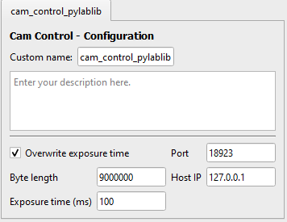

# Changing the Instrument Settings

If you want to add or change the settings that appear for your instrument open the `<driver_name>.py` file. Here is the file for the [cam-control driver](https://github.com/FAU-LAP/CAMELS_drivers/tree/main/cam_control_pylablib) as an example

```python
from nomad_camels_driver_cam_control_pylablib.cam_control_pylablib_ophyd import Cam_Control_Pylablib
from nomad_camels.main_classes import device_class

class subclass(device_class.Device):
    def __init__(self, **kwargs):
        super().__init__(name='cam_control_pylablib', 
                         virtual=False,
                         tags=['Camera'],
                         ophyd_device=Cam_Control_Pylablib,
                         ophyd_class_name='Cam_Control_Pylablib',
                         non_channel_functions=['start_saving', 
                                                'stop_saving', 
                                                'save_snapshot',
                                                'grab_background'],
                         **kwargs)
        self.config['exposure_time'] = 100  # in ms
        self.settings['overwrite_exposure_time'] = True
        self.settings['host_ip'] = '127.0.0.1'
        self.settings['port'] = 18923
        self.settings['byte_length'] = 9000000

class subclass_config(device_class.Simple_Config):
    def __init__(self, parent=None, data='', settings_dict=None,
                 config_dict=None, additional_info=None):
        labels = {'host_ip': 'Host IP',
                  'port': 'Port',
                  'byte_length': 'Byte length',
                  'exposure_time': 'Exposure time (ms)',
                  'overwrite_exposure_time': 'Overwrite exposure time'
                  }
        super().__init__(parent, 'Cam Control', data, settings_dict,
                         config_dict, additional_info,labels=labels )
        self.load_settings()
```

This generates the following instrument settings in the `Manage Instrument` window **automatically**. 


You do not need to write your own UI elements if you use the `device_class.Simple_Config` subclass!

```{note}
There is a difference between the `self.settings` and `self.config` parameters!\
The `settings` values are passed immediately to the instrument and are available right from the beginning. This makes sense for instrument settings that are required even before you can communicate with the instrument. Here for example the IP or port the instrument listens to. The values of the settings are simply variables that the `<driver_name>_ophyd.py` can use.\
The `config` value is passed to the instrument as an actual command at the start of every measurement protocol.
```

To see what the `config` setting writes to the instrument we must look at the
`<driver_name>_ophyd.py` file. All unnecessary code was removed to make it easier to read.

```python
from ophyd import Component as Cpt
from ophyd import Device
import socket
import re
import numpy as np
import time
import json
from nomad_camels.bluesky_handling.custom_function_signal import \
    Custom_Function_Signal, Custom_Function_SignalRO


class Cam_Control_Pylablib(Device):
    exposure_time = Cpt(Custom_Function_Signal, 
                        name='exposure_time',
                        kind='config', 
                        metadata={'unit': 'ms',
                                  'description': 'Camera exposure time in ms.'}
                        )
    def __init__(self, prefix='', *, name, kind=None, read_attrs=None,
                 configuration_attrs=None, parent=None,
                 # ---------------------------------------
                 # Here are the settings we passed to the instrument in the .py file with default values
                 host_ip='127.0.0.1',
                 port=18923,
                 byte_length=9000000,
                 overwrite_exposure_time=True,
                 # ---------------------------------------
                 **kwargs):
        super().__init__(prefix=prefix, name=name, kind=kind,
                         read_attrs=read_attrs,
                         configuration_attrs=configuration_attrs, parent=parent,
                         **kwargs)
        # Here are the settings we passed to the instrument in the .py file
        self.host_ip = host_ip
        self.port = port
        self.byte_length = byte_length
        self.overwrite_exposure_time = overwrite_exposure_time
        # ----------------------------------------------------------------------
        # Here we define what happens on startup when the value 
        # of the config setting is written to the instrument
        self.exposure_time.put_function = lambda x: self.exposure_time_function(exposure_time=x)

        # This if statement prevents the lines of the init below to be run when starting up CAMELS.
        if name == 'test':
            return
    # This function is called when the exposure time is set.
    def exposure_time_function(self, exposure_time=100):
        self.sock.sendall(bytes(
            r'{    "id": 0, "purpose": "request", "parameters": {"name": "gui/set/value", "args": {"name": "cam/cam/exposure", "value": ' + f'{exposure_time}' + '}}}' + "\n",
            "utf-8"))
        received = self.sock.recv(self.byte_length)
```

As the exposure time is a config setting that should be set at the beginning of every measurement the component (Cpt) has the property `kind = 'config'` ( see line 15).

By defining a `put_function` the standard behavior when setting the channel is overwritten 

```python
self.exposure_time.put_function = lambda x: self.exposure_time_function(exposure_time=x)
```

the exact function is then defined (see last paragraph in the code block above).

# Changing how to Set and Read Instrument

The functionality of the set and read channels can be modified in the `<driver_name>_ophyd.py` file.
A channel can either only be read (Signal_RO = read-only) or read and set (Signal). Signals are the _bluesky_ naming of our channels.

You can add custom read and write functions by overwriting the default `.read` and `.write` methods of your device. For example

```python
self.set_voltage.write = self.set_voltage_function
```

or 

```python
self.get_position.read_function = self.read_pos
```

the `.write` method expects a string that is sent to the instrument via the serial communication defined in the instrument settings.
The custom signal has a `.put_function` method that can be used to define what happens when a value is `set` in a measurement protocol. See the `exposure_time` above. 

You can then define what exactly is done using these functions:

- Setting

```python
def set_voltage_function(self, set_value):
    write_string = ''
    if self.Source_Type.get() != 'Voltage':
        raise Exception('You can not set a voltage if the Source Type is not set to "Voltage"!')
    if self.Source_Type_latest != 'Voltage':
        self.Source_Type_latest = 'Voltage'
        self.compliance_put_function('Voltage')
    write_string += f'B{set_value},{self.source_range_value},{int(self.Bias_delay.get())}XN1X'
    print(write_string)
    print(self.averages_value)
    return write_string
```

- Reading

```python
def read_pos(self):
    state = self.flip.get_state()
    if state is None:
        return -1
    return state
```


