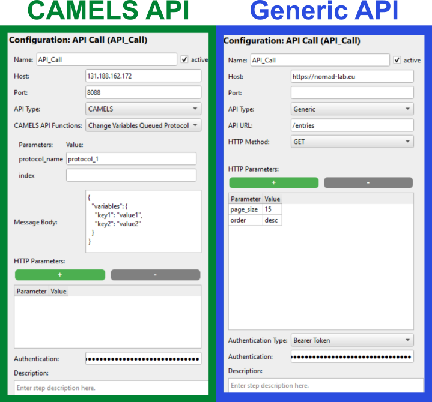
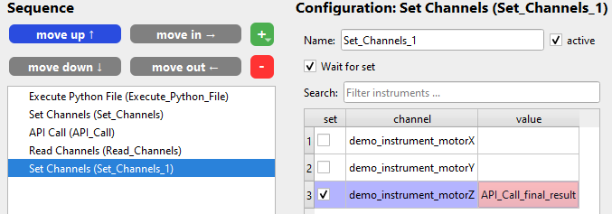

# Advanced steps

## API Call

This step allows you to call any API that is hosted on a server. It uses HTTP requests so you can communicate with any API that answers to something like

```bash
<host>:<port>/path/to/api?parameter=value
```

### Overview

Below is an example configuration for two different API calls. One to the CAMELS API and one generic call to [NOMAD](https://nomad-lab.eu/nomad-lab/).



### Configuration

There are several options to configure your API call:

#### Host - [String]

This is the host of the web server that you want to access. This can be an IP address or a URL.

If you enter a URL the host should end with the top-level domain, so something like `.com`, `.de`, `.org`, ...

```{note}
If the host URL you enter does not start with `http://` or `https://` then `http://` is **automatically prepended** to the URL.
```

#### Port - [Integer]

You might need to specify the exact port of the host you want to address.

```{note}
If you do not enter a port, then CAMELS will automatically add `80` for `http` requests and `443` for `https` requests. These are the default ports that for example browsers also use.
```

#### API Type - [Selection]

Select between the two options: [`CAMELS`](#api-type---camels) and [`Generic`](#api-type---generic).

#### API URL - [String]

Path of the API you want to access. Something like

```bash
/path/to/the/api
```

Before the URL path you enter CAMELS will prepend:

```bash
{http:// or https://}{host}{:port}
```

#### HTTP Method - `Generic` - [Selection]

Only available if you are using the `Generic` API call. You can select the type of HTTP request you want to send. These are the options:

- `GET`
- `POST`
- `DELETE`
- `PUT`
- `PATCH`

Which method you need depends on the the API you want to call. If you want to call the API the same way a regular web browser would then use the `GET` method.

`POST`, `PUT` and `PATCH` allow you to set a [message body](#message-body---string).

#### CAMELS - API Function - `CAMELS` [Selection]

Only available if you are using the `CAMELS` API call. This selection box will try and connect to the given CAMELS API and get all available functions.

```{caution}
You must enter the correct host and port for this to work. Otherwise you will not see the available functions but only the message `Could not connect to the sever.
```

Depending on the API function selected you will have different options of further configuring the request. You can for example enter a [message body](#message-body---string) and/or [function parameters](#camels-function-parameters-value---string) for some. The available settings will be automatically displayed for you to fill out.

#### Message Body - [String]

A dictionary containing information that should be transmitted as the *body* of your HTTP request. Will typically look something like:

```JSON
{
  "variables": {
    "key1": "value1",
    "key2": "value2"
  }
}
```

The exact contents depends on the API you are using. Above is an example when using the CAMELS API.

#### CAMELS Function Parameters Value - [String]

Some CAMELS API functions have parameters that can either be used directly in the URL like

```bash
/api/v1/actions/queue/variables/protocols/{protocol_name}_{index}
```

with the parameters `protocol_name` and `index`. Simply enter the string and/or number that fits your protocols.

#### HTTP Parameters - [Key:Value - String]

When using the `Generic` API calls you can define any number of parameters that you want to pass with the HTTP request in the form of 

```bash
/path/to/api?parameter1=value1&parameter2=value2&...
```

Add the desired number of parameters by using the green `+` symbol and enter the correct parameter name and the value you want to pass to it. In the [overview image](#overview) we pass the parameters `page_size` and `order` to the HTTP request.

#### Authentication Type - [Selection]

Here you can select the desired authentication schema the API uses ([see here](https://developer.mozilla.org/en-US/docs/Web/HTTP/Authentication) for more information).

Currently we support:

- `None`: No authentication.
- `HTTP Basic`: Authentication following the HTTP Basic schema with `username:password`
- `Bearer Token`: Single token or API key that is used by the APIs web server to authenticate its clients.

### Passing and Using Variables

You can pass all variables used in the protocol to the body of the HTTP requests.

The returned data (a dictionary) is converted to variables where the key name of the dictionary becomes the variable name prefixed by the *API Call* step name:

```python
<API Call step name>_key
```

 You can use these variables in the protocol steps following the API call.

So if your API call returns a dictionary like

```JSON
{
    "final_result": 123,
    "additional_result": 456
}
```

The *API Call* protocol step has the name `API_Call` so you can access the returned values in the following steps by using the variables
`API_Call_final_result` and `API_Call_additional_result`.
This would look like this for example



```{attention}
As CAMELS can not know what variables it will be getting, it will display all uses of these kinds of variables in red. You can simply ignore this visual warning.
```


## Call Function
Some instruments have functions that cannot be represented by channels. If the instrument provides such functions, these can be selected in this step.

An example for an instrument with a function is the Mechonics_CU30CL stage which provides a function to do its reference drive.


## Change Device Config
This step allows for changing an instruments configuration during the protocol. After selecting the desired instrument, the same / a similar window as in the "Manage Instruments" menu appears.

```{note}
CAMELS differentiates between _settings_ and _config_. Only the latter can be changed here, so the window may look a little different. (Settings represent things like for example whether the instrument currently has two or just one output channel connected.)
```

Besides that, in the drop-down menu below all the instruments is "_advanced configuration_". Here the config of all instruments can be changed at once, like one would normally do in [Set Channels](Channel_Steps.md#set-channels).

```{warning}
Make sure you completely understand the instrument when you use "_advanced configuration_". As it does not provide any drop-down menus, it is easily prone to errors.
```


## Execute Python File - Protocol Step

This step allows you to execute (run) any Python file on your system. To do this, enter the path to the file in the protocol step.

You can pass arguments to the Python script and save its results in variables so that you can continue to work with the returned data.

### Basic Functionality

This step calls something like

```python
subprocess.run(['python_exe_path', 'python_file_path', 'key=value', 'key2=value2', ...])
```

allowing you to execute a Python file with arbitrary arguments passed to it.

### The Python Environment

The Python file can be run using three different Python environment types. As CAMELS can not know which packages your script might need you have the possibility to define exactly which environment it should use:

1. **CAMELS Python**: This uses the same environment that is running CAMELS itself. This should be fine in many cases where you do not require unusual or very specific packages. You can find a list of the installed packages on our [GitHub](https://github.com/FAU-LAP/NOMAD-CAMELS/blob/main/requirements.txt).
2. **Existing Python Environment**: If you need very specific packages or very specific versions for your script to work you can also give the path to the `python.exe` of an already existing environment. The script will then be run using this python.exe. 
3. **Specific Packages**: If you only need a small number of very specific packages with specific versions you can use this option. Here you can define the package number and its version. The environment will be built at run time in a temp folder. It will then execute your script with this environment and then delete the environment again.
   ```{attention}
   Only do this if you really need this and don't do this very often, as this is quite slow!
   ```

### Passing Values

You can pass values to the Python file to be executed. These are the `key=value` pairs you can see in the command [above](#basic-function). 
To do this, add variables/keys and their value using the green button and then entering the desired values.

You can leave the value field empty. CAMELS will then try and find the variable name you gave in the current name space. 

```{note}
This means you can use channel or variable names here if you leave the value field empty!
```

If you give it a value it will pass the key value pair to the file.

To then use the key-value pairs in your script you can do something like

```python
# Parse the arguments into a dictionary assuming they are in key=value format
arguments = sys.argv[1:]
arguments_dict = {}
for arg in arguments:
    key, value = map(str.strip, arg.split("=", 1))
    arguments_dict[key] = value
```

and then use the `arguments_dict` to use the passed variables in any way you like.

### Returning Results

CAMELS can also read the results returned by your Python script. For this your script must `print()` the results, as CAMELS gets its results from the `stdout` of `subprocess.run`
It is recommended to do something like

```python
data = {
    "results": result,
    "results2": result2,
    ...
}
# Serialize the dictionary to a JSON formatted string
json_data = json.dumps(data)
# Print the JSON string and make sure it is passed to CAMELS
print("###Start Data") # Required so that CAMELS knows where to find the returned data!
print(json_data)
print("###End Data") # Required so that CAMELS knows where to find the returned data!
sys.stdout.flush()
```

where the keys of the returned dictionary match the variable names defined in the "Values returned by the Python file" table.

```{important}
You **MUST** print the `###Start Data` and `###End Data` strings so that CAMELS knows where to find the returned dictionary. This prevents other prints from your script from disturbing the data extraction later on.
``` 

CAMELS will then match the returned dictionary with the names of the values you defined that will be returned by the file and saves them to your data file.

Every key of the returned data dictionary is added to the Python namespace. This means you can access this variable the same way you would any other variable. You can use it for example to set an instrument channel to this value.

```{important}
You do not need to define the returned variable names. But if you do not, the returned value is not saved to the final data file! 

You can still access **ALL** the variables that are returned by the Python script in following protocol steps. In the example above you could still use `results2` as the variable for a *Set Channel* after the Python script execution. 
``` 

An example of a `Execute Python Script` step can be seen here.

This passes `factor=3` and what ever value the `Keithley_2000_read_voltage` channel read above to the script.
It expects a single returned result that will be saved and is accessible using the variable name `results`.

#### Returning Arrays

Your Python file can also return arrays. Unfortunately numpy arrays can not be serialized with JSON, this means you must first convert your array to a list. This can be easily done using the `.tolist()` method. So something like

```python
array = np.arange(10)
data = {
    "results": array.tolist(),
}
# Serialize the dictionary to a JSON formatted string
json_data = json.dumps(data)
print("###Start Data")
print(json_data)
print("###End Data")
sys.stdout.flush()
```

will work. The returned array is now a list, so you must consider this if you want to perform further interactions with the variable. So something like `results.mean()` will not work!

For multidimensional arrays you can use:

```python
class NumpyEncoder(json.JSONEncoder):
    def default(self, obj):
        if isinstance(obj, np.ndarray):
            return obj.tolist()
        return super().default(obj)

a = np.array([[1, 2, 3], [4, 5, 6]])
print(a.shape)
json_dump = json.dumps({'a': a, 'aa': [2, (2, 3, 4), a], 'bb': [2]}, 
                       cls=NumpyEncoder)
print(json_dump)

--> Output:
(2, 3)
{"a": [[1, 2, 3], [4, 5, 6]], "aa": [2, [2, 3, 4], [[1, 2, 3], [4, 5, 6]]], "bb": [2]}
```

```{note}
Anything that can be serialized with JSON can be returned by your Python file.
```


## Gradient Descent
The Gradient Descent can be used to find an optimum (minimum / maximum) of a user-provided function in dependence of one output channel. Several things need to be defined for this step:

- **extremum type:** whether to look for a maximum or a minimum
- **output channel:** the channel which is changed to find the extremum
- **optimization function:** a mathematical function that may include any variables or channels that CAMELS knows of
- **plot steps:** whether to plot the single steps of the gradient descent
- **starting value:** the first value of the output channel (see below, :math:`s_0`)
- **minimum value:** the minimum value the output channel should take (could be -inf, $s_{min}$)
- **maximum value:** the maximum value the output channel should take (could be +inf, $s_{max}$)
- **learning rate:** a value that controls the step size (see below, $l$)
- **threshold:** when to stop the gradient descent (see below, $\Delta f_t$)
- **momentum:** if several steps are done in the same direction this controls how much larger they become (see below, $m$)
- **smallest step:** the smallest step size between two values, useful if otherwise the correct range is never reached (see below, $\Delta s_{min}$)
- **largest step:** the largest step allowed, may help to not jump over the extremum (see below, $\Delta s_{max}$)
- **max number of steps:** after that number of single steps, the algorithms stops and the best value found up to that point will be used (see below, $n_{max}$)
- **read channels:** the channels that are read for each step (**important**: you need to read the channels, that you want to use in the optimization function!)

To understand the step, the employed algorithm is explained:
- For each step $n$, the output value $s_n$ is set, the given channels are read and the optimization function is evaluated $f_n$, and the difference $\Delta f_n = f_n - f_{n-1}$ is calculated. In the first step $n=0$: $\Delta f_0 = \infty$.
- After each step, it is checked whether the maximum number of steps is reached or whether the threshold is reached. This however only breaks the loop if the step size $\Delta s_n = s_n - s_{n-1}$ is smaller than $10 \cdot \Delta s_{min}$. I.e. the algorithm runs as long as:
  ```{math}
  n < n_{max} \land (|\Delta f_n| > \Delta f_t \lor |\Delta s_n| > 10 \cdot \Delta s_{min})
  ```
- The next step $s_{n+1}$ is calculated with the gradient of the function, learning rate $l$ and momentum $m$:
  $$\Delta s_{n+1} = \pm l \cdot \frac{\Delta f_n}{\Delta s_n} + m \cdot \Delta s_n$$
  with "$+$" for a maximum and "$-$" for a minimum. $\Delta s_{n+1}$ is coerced into $\Delta s_{min} < |\Delta s_{n+1}| < \Delta s_{max}$. Then :math:`s_{n+1} = s_n + \Delta s_{n+1}` is coerced to $s_{n+1} \in [s_{min}, s_{max}]$

The adaptations in comparison to a standard gradient descent (i.e. the step size in a certain range and not too large for the termination criteria) is employed here to work with noisy data.

```{note}
If you have problems using this step or the implementation does not meet your requirements, feel free to [contact us](mailto:nomad-camels@fau.de) or open an issue on [GitHub](https://github.com/FAU-LAP/NOMAD-CAMELS/issues).
```


## Prompt
This step displays a dialog box on the screen and pauses the protocol execution until the user clicks "OK" on the box. It may be useful to provide instructions to the user, for example that they need to turn some knob manually at this point.

_Title_ is the window-title of the box.

The _Text_ will be displayed to the user who runs the protocol.

If _can abort protocol_ is selected, besides the "OK" button, the box will also have a "abort protocol" button. That immediately stops the protocol instead of running the next steps.

```{note}
While the prompt is displayed, you cannot interact with the other windows of CAMELS, so if you want the user to be able to stop the protocol at this step, make sure to check _can abort protocol_~
```

## Set Value Popup
The step displays a dialog box that pauses the execution of the protocol until the user is done with the dialog box.

Depending on the settings, the popup may allow for setting specific channels or variables.
When setting variables, one may give the step a `combobox-list` in the table `Variables`. This list can be anything like `[1, 2, 3]` or `[True, False]` and provides a dropdown menu to choose from when the step is executed.

With "_allow free channel / variable setting_", the user can enter any channel or variable in the dialog box and give it a value.

