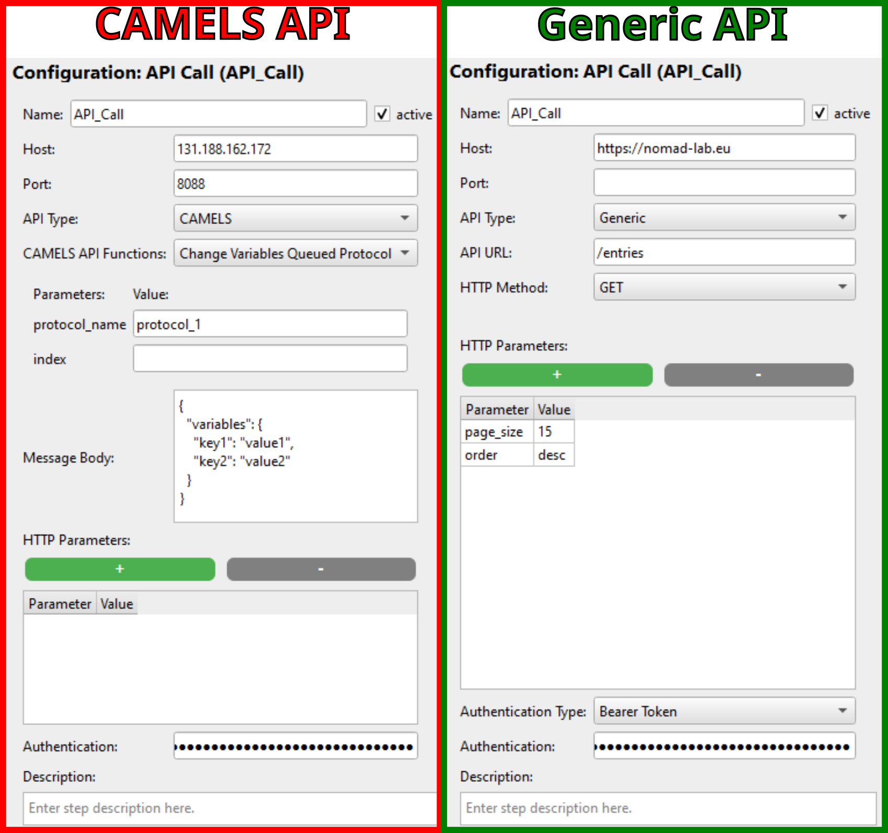
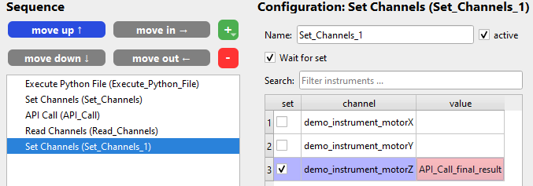

# Call API - Protocol Step

This step allows you to call any API that is hosted on a server. It uses HTTP requests so you can communicate with any API that answers to something like

```bash
<host>:<port>/path/to/api?parameter=value
```

## Overview

Below is an example configuration for two different API calls. One to the CAMELS API and one generic call to [NOMAD](https://nomad-lab.eu/nomad-lab/).



## Configuration

There are several options to configure your API call:

### Host - [String]

This is the host of the web server that you want to access. This can be an IP address or a URL.

If you enter a URL the host should end with the top-level domain, so something like `.com`, `.de`, `.org`, ...

```{note}
If the host URL you enter does not start with `http://` or `https://` then `http://` is **automatically prepended** to the URL.
```

### Port - [Integer]

You might need to specify the exact port of the host you want to address.

```{note}
If you do not enter a port, then CAMELS will automatically add `80` for `http` requests and `443` for `https` requests. These are the default ports that for example browsers also use.
```

### API Type - [Selection]

Select between the two options: [`CAMELS`](#api-type---camels) and [`Generic`](#api-type---generic).

### API URL - [String]

Path of the API you want to access. Something like

```bash
/path/to/the/api
```

Before the URL path you enter CAMELS will prepend:

```bash
{http:// or https://}{host}{:port}
```

### HTTP Method - `Generic` - [Selection]

Only available if you are using the `Generic` API call. You can select the type of HTTP request you want to send. These are the options:

- `GET`
- `POST`
- `DELETE`
- `PUT`
- `PATCH`

Which method you need depends on the the API you want to call. If you want to call the API the same way a regular web browser would then use the `GET` method.

`POST`, `PUT` and `PATCH` allow you to set a [message body](#message-body---string).

### CAMELS - API Function - `CAMELS` [Selection]

Only available if you are using the `CAMELS` API call. This selection box will try and connect to the given CAMELS API and get all available functions.

```{caution}
You must enter the correct host and port for this to work. Otherwise you will not see the available functions but only the message `Could not connect to the sever.
```

Depending on the API function selected you will have different options of further configuring the request. You can for example enter a [message body](#message-body---string) and/or [function parameters](#camels-function-parameters-value---string) for some. The available settings will be automatically displayed for you to fill out.

### Message Body - [String]

A dictionary containing information that should be transmitted as the *body* of your HTTP request. Will typically look something like:

```JSON
{
  "variables": {
    "key1": "value1",
    "key2": "value2"
  }
}
```

The exact contents depends on the API you are using. Above is an example when using the CAMELS API.

### CAMELS Function Parameters Value - [String]

Some CAMELS API functions have parameters that can either be used directly in the URL like

```bash
/api/v1/actions/queue/variables/protocols/{protocol_name}_{index}
```

with the parameters `protocol_name` and `index`. Simply enter the string and/or number that fits your protocols.

### HTTP Parameters - [Key:Value - String]

When using the `Generic` API calls you can define any number of parameters that you want to pass with the HTTP request in the form of 

```bash
/path/to/api?parameter1=value1&parameter2=value2&...
```

Add the desired number of parameters by using the green `+` symbol and enter the correct parameter name and the value you want to pass to it. In the [overview image](#overview) we pass the parameters `page_size` and `order` to the HTTP request.

### Authentication Type - [Selection]

Here you can select the desired authentication schema the API uses ([see here](https://developer.mozilla.org/en-US/docs/Web/HTTP/Authentication) for more information).

Currently we support:

- `None`: No authentication.
- `HTTP Basic`: Authentication following the HTTP Basic schema with `username:password`
- `Bearer Token`: Single token or API key that is used by the APIs web server to authenticate its clients.

## Passing and Using Variables

You can pass all variables used in the protocol to the body of the HTTP requests.

The returned data (a dictionary) is converted to variables where the key name of the dictionary becomes the variable name prefixed by the *API Call* step name:

```python
<API Call step name>_key
```

 You can use these variables in the protocol steps following the API call.

So if your API call returns a dictionary like

```JSON
{
    "final_result": 123,
    "additional_result": 456
}
```

The *API Call* protocol step has the name `API_Call` so you can access the returned values in the following steps by using the variables
`API_Call_final_result` and `API_Call_additional_result`.
This would look like this for example



```{attention}
As CAMELS can not know what variables it will be getting, it will display all uses of these kinds of variables in red. You can simply ignore this visual warning.
```
