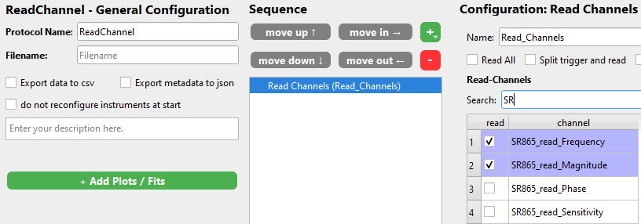

# Read Channels

This protocol step allows you to read data from all the instruments you have installed and also created instances of.

The name of each channel that you can read is something like `<instrument_name>_<parameter>` where parameter is a physical entity like `voltage`, `current`, `camera`. The available channels you can read are defined in the drivers for each instrument. Signals that you can set as well as read-only signals (called *SignalsRO*) create readable channels.

If you are using a SweepMe! instrument you can read everything that is in `self.variables` depending on the `SweepMode` selected.

Simply mark the checkbox to read the desired channels.

