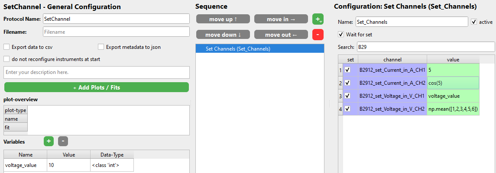

# Set Channels

This protocol step allows you to set channels of the instruments you have installed and also created instances of.

The name of each channel that you can set is `<instrument_name>_set_<parameter>` where `<parameter>` is some thing like `voltage`, `current`, `camera_exposure_time`. The available channels you can set are defined in the drivers. Signals create readable channels.

If you are using a SweepMe! instrument you can only set channels if the instrument has a `SweepMode`. Depending on the mode selected in the *Instrument Manager* you will have the corresponding *Set Channel*.

Mark the checkbox to set the desired channels. Then enter the value that you want to set to the instrument into the value field. This value can either be a number, a Python expression that is evaluated at runtime or variables. This means you can set channels using complex python code. So something like `np.mean([1,2,3,4,5,6])` will evaluate to `3.5`. The available functions can be found by right clicking and looking at the `Insert Function` option. When CAMELS understands your expression the value field should turn green. If not is it red and will most likely not work. For very complex commands the red color might not be correct and it can work at runtime. 

You can also set channels to the value of variables that you defined before. You can do this in the bottom left of the window. Simply right-click and enter `Insert Variable`. Again you can apply any Python code to the variable and treat it as if it was a number.

Example of setting channels:

Here are the available functions you can use:

