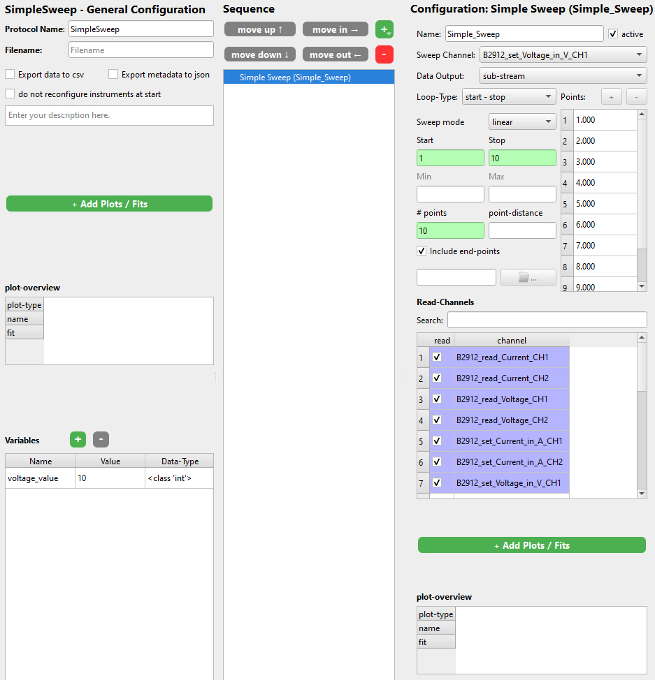

# Simple Sweep

The Simple Sweep step is a convenient way to create a sweep for a single channel (so changing the value of one channel) while reading any number of other channels for each setpoint of the sweep channel.

First select the channel you want to sweep (change). Then like in the For Loop, define the loop-type. Then define the list of values you want. Typically by giving start and stop (and min /max) values. Lastly select the channels you want to read for each value of the sweep channel.

In the end it can look something like this:

