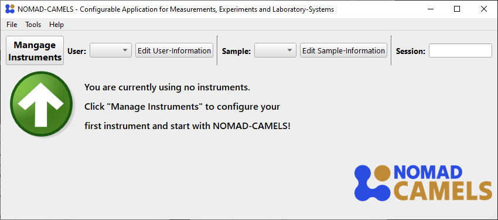
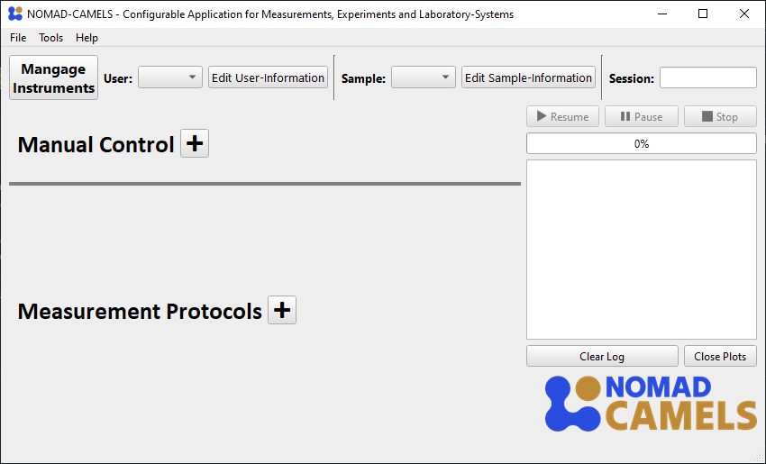

(top-link)=
# Installation and Configuration of a Demo Instrument
This page should help you learn how to use CAMELS, especially if this is your first time using CAMELS. It shows you how to add (install) a new instrument (`demo device`) to CAMELS, how to configure it, and how to set and measure the `demo device`.
## 1. Installation of Demo Device
When you first start up NOMAD-CAMELS, you should see something like the following:  

Clicking on the "Manage Instruments" button will open a dialog where you can install available instruments from the CAMELS repository (PyPi).

```{image} img_1.png
:width: 49%
```
```{image} img_3.png
:width: 49%
```

On the left we can see the instrument selection window and on the right you can see the screen after successful installation of the instruments. 
- Check the instruments you want to install. To follow this example  install the `demo device`. 
- Then click `Install / update Selected` to install the most recent version of the instrument from PyPi (this is done internally with a simple `pip install <instrument_name>`).

&#9888; This means you can also use the virtual python environment `.desertenv` to manually install devices by running:
```powershell
pip install --no-cache-dir --index-url https://test.pypi.org/simple/ --extra-index-url https://pypi.org/simple nomad_camels_driver_<parent_driver_name>
```

&#9888; For this to work you must activate the correct virtual environment first!
Run this code with the correct path in powershell to activate the virtual environment:
```powershell
cd \Path\to\NOMAD-CAMELS\.desertenv\Scripts\
.\activate
```


---

```{image} img_2.png
:width: 65%
:align: right
```

You can also filter the instruments by their name using the `Search name` field as you see here.

<br/><br/><br/><br/>

---

## 2. Configuring Instruments

After successful installation you can switch to the "Configure Instruments" tab.\
Here all the available instruments are listed as well as the number of instances (so 'actual' instruments) you have added of the installed instrument type.\
For this  select the instrument type you want to add and click the &#10133; symbol under `Configure`.

```{image} img_4.png
:width: 49%
```
```{image} img_5.png
:width: 49%
```

After adding the instrument a new instance of this instrument type is created. You can add as many instances of instruments as you like by  pushing the &#10133; symbol. This adds additional tabs with the `Custom name` you gave the instrument. By default, the naming  increments a number after the device name.

## 3. Change Instrument Settings
You can then change the instrument settings as you wish.\
You can add a plain text description of the instrument and what you are planning to do with it. This is added to the **metadata** of your measurement when the instrument is used. This can help you better understand what the instrument does for larger project and allows others to better understand your measurement data.

```{image} img_6.png
:width: 49%
```
```{image} img_7.png
:width: 49%
```

---

When you are happy with the instruments settings and have added all the instruments required for your measurements you can  click `OK` to save all the instruments and settings to CAMELS.

---
## What's next?
After adding at least one instrument to CAMELS you now have two ways to control the instrument:
1. [_Measurement Protocols_](quick_start_protocols.md)\
   Use it for measurement procedures. How to set up and use protocols is explained on this page.
2. [_Manual Control_](https://fau-lap.github.io/NOMAD-CAMELS/docs/Tutorials/quick_start/quick_start_manual_control.html)\
   Manually change and control individual channels. This is useful for controlling stages without having to create a protocol. How to use this functionality is explained in more detail [here](https://fau-lap.github.io/NOMAD-CAMELS/docs/Tutorials/quick_start/quick_start_manual_control.html).
   

[&#8679; Back to the top &#8679;](top-link)