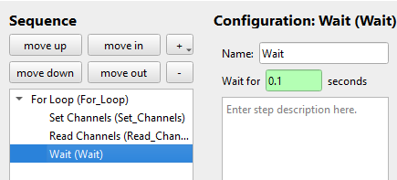

(plots_top_link)=
# How to Create Plots for Measurements
You can display live-plots in the measurement protocols to see what is happening during the measurement. 
## 1. Configure Plots
To configure the plots  click `Define Plots / Fits` in the protocol window. Here we bill be doing this for the `For Loop` measurement protocol created [in the Tutorial](quick_start_protocols.md).

Add a new plot by clicking the &#10133; symbol and choosing a plot type.

```{image} images/img_49.png
:width: 40%
```

The `x-axis` is set by either typing the channel into the field or by  right-clicking and adding the channel value with `Insert Channel Value`. We will be plotting the `motorZ` channel (y-axis) against `For_Loop_Count` (x-axis). Add a new y-axis with the &#10133; symbol next to `y-axes`. Enter the `motorZ` channel via right click into the `formula` field. As with most fields you can to any mathematical operation as a string in this field (see examples above for more information). Select if the y-axis should be plotted on the left or right side of the x-axis. \


Give the plot a `x-label` and `y-label` as well as a `title`. 

A finished plot configuration (without a fit) could look like this for example

## 2. Run Protocol with Plots
If you then run the protocol the plot is displayed and updated for every new data point that is measured.

```{image} images/img_52.png
:width: 80%
```

```{note}
 For very fast measurements the plotting can be too slow and cause errors when displaying the plot. So especially when dealing with pure software instruments with very fast communication times it might help to add a wait time in the protocol. This is purely a displaying error and all data points are recorded correctly in the measurement file.
 ```

To get a working plot here you have to modify the protocol from [before](https://fau-lap.github.io/NOMAD-CAMELS/docs/Tutorials/quick_start/quick_start_protocols.html#13-sweeping-using-a-for-loop-step) by adding a small `Wait` time of `0.1` seconds as the internal software sweep is too fast for the plot to follow.




[&#8679; Back to the top &#8679;](plots_top_link)
