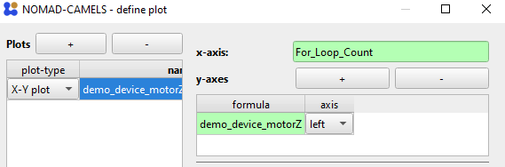

(plots_top_link)=
# Setting Up Plots in Protocols
You can display live-plots in the measurement protocols to have a better understanding of what is going on during the measurement. 
## 1. Configure Plots
To configure the plots  click `Define Plots / Fits`. Here we bill be doing this for the for-loop measurement protocol created [in the Tutorial](https://fau-lap.github.io/NOMAD-CAMELS/docs/Tutorials/quick_start/quick_start_protocols.html#13-sweeping-using-a-for-loop-step).

Add a new plot by clicking the &#10133; symbol and choosing a plot type.

```{image} img_49.png
:width: 40%
```

The `x-axis` is set by either typing the channel into the field or by  right-clicking and adding the channel value with `Insert Channel Value`. We will be plotting the `motorZ` channel (y-axis) against `For_Loop_Count` (x-axis). Add a new y-axis with the &#10133; symbol next to `y-axes`. Enter the `motorZ` channel via right click into the `formula` field. As with most fields you can to any mathematical operation as a string in this field (see examples above for more information). Select if the y-axis should be plotted on the left or right side of the x-axis. \


Give the plot a `x-label` and `y-label` as well as a `title`. 

A finished plot configuration (without a fit) could look like this for example

## 2. Run Protocol with Plots
If you then run the protocol the plot is displayed and updated live.

```{image} img_52.png
:width: 80%
```

> &#9888; To get this plot you have to modify the protocol from [before](https://fau-lap.github.io/NOMAD-CAMELS/docs/Tutorials/quick_start/quick_start_protocols.html#13-sweeping-using-a-for-loop-step) by adding a small `Wait` time of `0.1` seconds as the internal software sweep is too fast for the plot to follow.\
> 


[&#8679; Back to the top &#8679;](plots_top_link)
