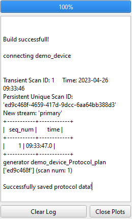
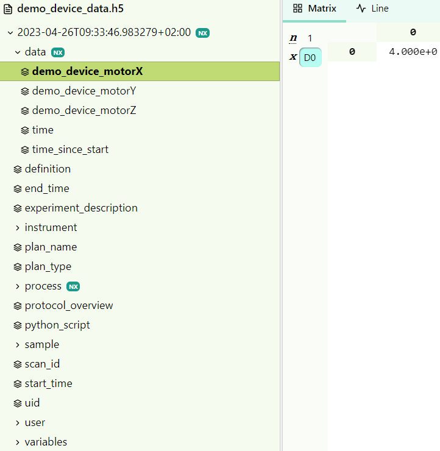
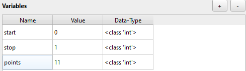
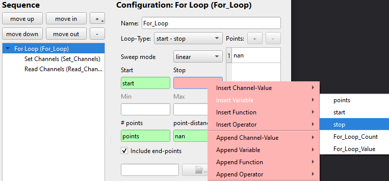

(protocols_top_link)=
# How to Perform Measurements
Measurement protocols are the main way in which CAMELS performs measurements. It can be understood as something similar to a _measurement recipe_ where a step for step guide is given to different instruments to perform a measurement procedure.

A good example of such a measurement procedure is a temperature dependant current-voltage (IV) measurement. Here the temperature of a sample is set to a specific value with a PID controller and waits for the temperature to be stable. Then it performs an IV-sweep, so it sets a voltage and measures the accompanying current for a given range of voltage values (often something like 100 points between -1 V and +1V).\
The temperature set-points are also set to values in a given range (for example from 295K to 320K in 25 steps).\
So one would need to nest different loops (one for setting teh temperature and one for setting the voltage). This can be done quite  using CAMELS.


## 1. Simple Start with a `demo_instrument`
But let's start very simple with the `demo_instrument` which is a pure software implementation of an instrument. 

Start by clicking the large &#10133; symbol next to `Measurement Protocols`. This opens up an empty protocol window.\


Here you can fully configure the measurement routine you want to perform. Give the protocol a custom name using `Protocol Name`. With `Filename` you set the name of data file that is created during the measurement. You can also add a custom description to describe what your measurement protocol does.

One key part of this window is the `Sequence` element on the left.
Here you will configure the individual steps of the measurement procedure.

Right click into the empty space to add a new step

```{image} img_10.png
:width: 75%
```
or use the small &#10133; symbol in the top right to add a new step.
```{image} img_11.png
:width: 75%
```

### 1.1. Add Set and Read Steps

We can now add two of the most important steps:
- **Set Channels**
- **Read Channels**
 


Each instrument has specific `channels` which can be read and set (changed) or only read.
Depending on the exact implementation of the instruments channels they are either 'software channels' so they themselves do not actually require communication with the actual instrument but store important values or settings, or they are _instrument channels_ and either _read from_ or _write to_ the instrument (or both). 

Below you can see the readable and the settable channels of the `demo_device`. 

```{image} img_13.png
:width: 53%
```
```{image} img_14.png
:width: 46%
```

[&#8679; Back to the top &#8679;](protocols_top_link)

---

## 2. How to Set and Read Individual Channels
Let's see how you can set and read individual channels.

### 2.1. Set Channels
We can now configure the protocol so that first each motor channel (`X`,`Y`,`Z`) are set to a value (in this case `1`,`2`,`3`).

```{image} img_15.png
:width: 49%
```
```{image} img_16.png
:width: 49%
```

> The green background of the `value` field tells you that CAMELS understands the entry as it expects to see a number (float) here.\
> &#9888; If you enter a value which CAMELS can not convert to float it will **change the background to red** (see image on the right).

### 2.2. Use Variables

> &#9888; You can use variables instead of 'hard-coding' values.\
> &#9888; You can use most symbolic math operations the same way you would in regular Python code in the value field to perform calculations before setting the result of the calculation.

For this simply add a variable on the bottom right of the protocol screen with the &#10133; symbol

```{image} img_17.png
:width: 49%
```
```{image} img_18.png
:width: 49%
```

and change the `Name` and `Value` to what ever you need. The `Data-Type` will change depending on the value you input and can be used to make sure that CAMELS correctly 'understands' the value.

To use this variable in the protocol (here in `Set Channels`)  right-click the value field and `insert` or `append` the desired variable you created.\


- `Insert` will overwrite any existing value in the field 
- `Append` will add the string name of the variable at the end of the value field. This is useful when creating longer functions with multiple variables.

You can use math notation as you would in a normal Pythons script (you can use `np.*` variables; like `np.sin(1)`) to perform calculations before setting the value:\
\
This should evaluate to `(1+1)*2=4`. You can also insert or append 
- functions
- operators 
- channel values

---

### 2.3. Read Channels
To read the channels we just set,  configure the `Read Channels` step to read the three motor channels:\
\
You can now run the protocol by confirming the configuration with `OK` and then pressing the `run` button.\
\
This should build the protocol (converts your recipe to a Python script that uses [Bluesky](https://blueskyproject.io/) to orchestrate the measurement) and run it; resulting in information about the run in the log on the right side of the window.\


This creates a HDF5 file in the location specified by the data saving location set in `Settings` and the user and sample name. This file contains all the read data and all the metadata known to CAMELS. With a simple HDF5 viewer like [H5web](https://h5web.panosc.eu/h5wasm) you can easily read and display the data.\
\
We can see that the `motorX` was set correctly to a value of 4.

[&#8679; Back to the top &#8679;](protocols_top_link)

---

(sweeping-using-a-for-loop-step)=
## 3. How to create a Sweep using the `For Loop` step
A _sweep_ is a type of measurement where a single channel is changed from one value to another in a number of steps. For each step an arbitrary number of other channels is read and actions are performed. A typical measurement of this type is the _temperature sweep_ where a number of different temperatures are set and for each temperature e. g. the current is measured.

To start, create a new Protocol by clicking the large ➕ symbol next to `Measurement Protocols` in the main window.
### 3.1. Create Steps
Create a `For Loop ` step as the first step in the sequence.\


Right-click the `For loop` step and click `Add Into` to add a `Set Channel` step into the `For loop`. Steps within a `For loop` are executed for each iteration of the loop.\


Then also add a `Read Channel` step by right-clicking the `Set Channels` step and using `Insert Below`.\


### 3.2. Create Variables
> &#9888; This step is optional.

Add these variables to make it clearer what values are used in the `For Loop`. This also makes maintaining the protocol easier and enables you to more easily share it with others.   

### 3.3. Set Channels (using variables)
Start by setting the start, stop and number of points of the `For Loop`. To do this either  type the number you want into the field or you can use the variables created above to set these parameters. To use the variables  right-click the field and select `Insert Variable` and then `stop`. Like this for example:


When you entered the three relevant parameters you should see a list of points appear on the right side showing you which value the points you created will have.\


Now go to `Set Channels` and set the three motor channels of the `demo_device` to the value you want. For demonstration purposes we will set each channel to a function that uses either `For_Loop_Count` or `For_Loop_Value`. Where `Count` is the number of iteration of the for-loop; here for example it starts with `1` goes to `11`, increasing by `1` for each iteration. This can be used to count and keep track of your iterations. `Value` is the value belonging to the iteration count; here it would go from `0` to `1` in steps of `0.2`.   The name of these two variables changes if you rename the `For loop` step to `<name_for_loop>_Count` and `<name_for_loop>_Value`.
\
We set 
- `motorX` to `For_Loop_Count`
- `motorY` to `For_Loop_Value`
- `motorZ` to `For_Loop_Count + For_Loop_Value`

to show how to use the variables and the mathematical operations (here `+`) in value fields.

### 3.4. Read Channels
Now set which channels should be read each time the loop is iterated over. If you like you can  select `Read All` at the top to read all available channels. You could of course select individual channels if you want read fewer. Here we are only interested in the motor channels, so we will only read these. 


### 3.5. Run Sweep Protocol
Now  click `OK` and `run` the protocol.
\
You can already see the eleven iterations the loop makes from the console window.
### 3.6. Sweep Data
Now lets look at the data produced. The HDF5 file with the data is saved into the location specified by you. With a simple HDF5 viewer like [H5web](https://h5web.panosc.eu/h5wasm) you can easily read and display the data.
```{image} img_36.png
:width: 62%
```


Here are the other two motor channels

```{image} img_37.png
:width: 22%
```
```{image} img_38.png
:width: 21.3%
```

We can see that the mathematical operation of adding `Count` and `Value` for `motorZ` worked.

[&#8679; Back to the top &#8679;](protocols_top_link)

---

## 4. How to use the `Simple Sweep` functionality
If you want to sweep and set one channel (e.g. temperature) and read any number of other channels (e.g. current and voltage) you can either use a `For Loop` as described [above](sweeping-using-a-for-loop-step) or you can use the _Simple Sweep_ functionality which is a more optimized and powerful tool for 
this task.

### 4.1. Create `Simple Sweep` Step
Start by creating a new Protocol by clicking the large ➕ symbol next to `Measurement Protocols`in the main window. Add a `Simple Sweep` step into the sequence.
### 4.2. Customize Simple Sweep
You can now configure the `Simple Sweep`. This is quite similar to configuring the `For loop` step [above](sweeping-using-a-for-loop-step). But you must first configure the Sweep Channel, so the channel that should be changed and set. We will use the `motorX` channel of the `demo_instrument` for this example.
\
`Data Output` configures in which Bluesky stream the sweep is run. `sub-stream` should be fine for most cases.\
Select the `Loop-Type` and `Sweep mode` you want.
```{image} img_40.png
:width: 30%
```
```{image} img_41.png
:width: 34.8%
```

Set the `Start`, `Stop` and `points` parameters. For this we can again use variables as done [above](sweeping-using-a-for-loop-step). Then select which channels you want to read. We will only select the `motorX` channel. As this is the only channel that is changed.
```{image} img_42.png
:width: 70%
```

### 4.3. Run _Simple Sweep_
Click `OK` and `run` the protocol.\
\

### 4.4. Data File
Now lets look at the data produced. The HDF5 file with the data is saved into the location specified by you. With a simple HDF5 viewer like [H5web](https://h5web.panosc.eu/h5wasm) you can easily read and display the data.
```{image} img_44.png
:width: 75%
```

We can see that the set points of `motorX` are read successfully.


[&#8679; Back to the top &#8679;](protocols_top_link)
