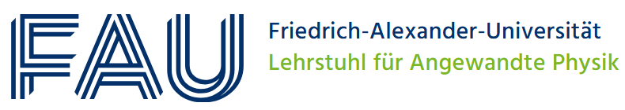

.. raw:: html
   

###############################
NOMAD CAMELS
###############################

.. raw:: html

    <h2 style="float: left;">Your Simple Path to FAIR Experimental Data</h2>

     

    

    

        <a id="installCamelsLink" rel="noopener noreferrer" style="flex: 1; display: inline-block; padding: 12px 20px; background-color: #4CAF50; color: white; text-align: center; text-decoration: none; font-size: 16px; border-radius: 4px; margin: 10px 0; font-weight: bold; border: 2px solid #4CAF50;">
            Install CAMELS
        </a>
        <a href="./doc/tutorials/quick_start.html" rel="noopener noreferrer" style="flex: 1; display: inline-block; padding: 12px 20px; background-color: #ffffff; color: #4CAF50; text-align: center; text-decoration: none; font-size: 16px; border-radius: 4px; margin: 10px 0; font-weight: bold; border: 4px solid #4CAF50;">
            Getting Started
        </a>
    

What is NOMAD CAMELS?
=========================

Automating your measurements, easy usage, rich metadata and FAIR-compliant data are what NOMAD CAMELS is all about. **CAMELS** (\ **C**\ onfigurable \ **A**\ pplication for \ **M**\ easurements, \ **E**\ xperiments and \ **L**\ aboratory \ **S**\ ystems) is an open-source measurement software that simplifies the process of data acquisition and analysis for you.

.. raw:: html

    

        <iframe src="https://www.youtube.com/embed/rVmxgwhoEVg" style="position: absolute; top: 0; left: 0; width: 100%; height: 100%;" allow="autoplay" frameborder="0" allowfullscreen></iframe>
    

.. raw:: html

      

CAMELS provides a graphical user interface (GUI) that can be used to setup instrument control and measurement protocols. The GUI then generates Python code that interfaces with `bluesky <https://blueskyproject.io/>`_ to communicate with the instruments and orchestrate the measurement. CAMELS can also be used to communicate with large-scale, distributed systems implemented with `EPICS <https://epics-controls.org/>`_.

Cite NOMAD CAMELS
-----------------

Learn more about CAMELS in our peer-reviewed paper:

.. image:: https://joss.theoj.org/papers/10.21105/joss.06371/status.svg
   :target: https://doi.org/10.21105/joss.06371

Why CAMELS?
===========

.. raw:: html

    

        

            
Smooth installation

            

                CAMELS is a Python package distributed via PyPI. It is easily installable on any computer. On Windows, let the installer do all the work for you.
            

        

        

            
Easy to use

            

                No programming skills required. Just configure your measurement and process protocols. Get it done within minutes.
            

        

        

            
FAIR data

            

                Automatically store FAIR data with rich metadata that lets you and others understand your experiment in detail. Optionally connect directly with your NOMAD Oasis.
            

        

        

            
Flexible and extendable

            

                Add further instruments to your setup at will. Reuse and adapt existing measurements quickly.
            

        

        

            
Scalable

            

                Work with small setups using directly connected instruments. Or connect to large distributed systems using advanced protocols like EPICS.
            

        

        

            
Community driven

            

                Contribute to CAMELS and add further instruments on GitHub. CAMELS comes with an instrument driver wizard that helps you implement new instruments.
            

        

    

In experimental sciences experiments often utilize a multitude of different measurement devices used in dynamically changing setups. Changing measurement procedures or adding new devices is often cumbersome and difficult as it often requires advanced programming knowledge. CAMELS allows you to define instrument control and measurement protocols using a graphical user interface (GUI) where each measurement step can be added with the click of a button. This provides a low entry-threshold enabling the creation of new and sophisticated measurement protocols without programming knowledge or a deeper understanding of device communication.

Who is CAMELS for?
==================
CAMELS is suited for any researcher not wanting to deal with measurement orchestration and device communication while still having full control and sophisticated data and metadata saving. Implementing new instruments can be done by any one and can be shared with the community.
As CAMELS takes care of saving all available metadata, you can share understandable measurement data with colleagues and other researchers with just a few clicks.

How to get started?
===================
To get started with CAMELS first `install <https://fau-lap.github.io/NOMAD-CAMELS/doc/installation/installation.html>`_ it and learn how to use it with our "Getting started" `tutorial <https://fau-lap.github.io/NOMAD-CAMELS/doc/tutorials/quick_start.html>`_.

Who is behind CAMELS?
========================
CAMELS is being developed in the framework of the NFDI consortium `FAIRmat <https://www.fairmat-nfdi.eu/fairmat/>`_ (see also: `NOMAD <https://nomad-lab.eu/nomad-lab/>`_) at the `FAU Erlangen-Nürnberg <https://www.lap.physik.nat.fau.eu/>`_. 

.. raw:: html

   

Contact and Community
=====================

If you have questions or problems with CAMELS we invite you to contact us via Discord:

.. raw:: html

    

search for the channels **discussion-camels** or **issues-camels**. 

You can also open GitHub Issues:

.. image:: /assets/CAMELS_Issues_Logo.png
   :target: https://github.com/FAU-LAP/NOMAD-CAMELS/issues
   :width: 187px
   :height: 50px

The source code of CAMELS is hosted on GitHub:

.. image:: /assets/CAMELS_GitHub_Logo.png
   :target: https://github.com/FAU-LAP/NOMAD-CAMELS
   :width: 214px
   :height: 50px

We invite you to open issues on GitHub if you encounter any problems or bugs.

If you have any questions or feedback you can also always reach the development team of CAMELS via E-mail:

E-mail `nomad-camels@fau.de <mailto:nomad-camels@fau.de>`_

.. toctree::
    :maxdepth: 2
    :hidden:

    Home <self>

.. toctree::
   :maxdepth: 2
   :caption: User's Guide
   :hidden:

   Installing CAMELS <doc/installation/installation.md>
   Getting Started <doc/tutorials/quick_start.md>
   Protocol Steps Explained <doc/protocol_steps/protocol_steps_landing.md>
   HDF5 files <doc/handling_hdf5.md>
   Data Evaluation <doc/nomad_camels_toolbox.md>
   NOMAD Integration <doc/NOMAAD_integration.md>
   CAMELS API <doc/api/api_landing.md>
   FAQ / Troubleshooting <doc/faq/faq.md>

.. toctree::
   :maxdepth: 2
   :caption: Instruments
   :hidden:

   Available Instruments <doc/instruments/instruments.rst>
   Special Instruments Drivers <doc/instruments/special_instruments.md>
   Create New Instrument Drivers <doc/programmers_guide/instrument_drivers.md>
   Combination with EPICS - EPICS Guides <doc/epics/epics_overview.md>
   

.. toctree::
   :maxdepth: 2
   :caption: Developer's Guide
   :hidden:

   Maintain CAMELS <doc/programmers_guide/programmers_guide.md>
   Code Description <doc/programmers_guide/components/components.md>
   Contributing <doc/contribute/general_process.md>
   Running Tests <doc/contribute/running_tests.md>
   Code of Conduct <doc/contribute/code_of_conduct.md>

.. toctree::
   :maxdepth: 2
   :caption: Videos
   :hidden:

   User Feedback <doc/videos/user_feedback.md>
   Developer Statements <doc/videos/developer_statements.md>

.. toctree::
   :maxdepth: 2
   :caption: Code Reference
   :hidden:

   nomad-camels <code/nomad_camels.rst>
   nomad-camels-toolbox <code/nomad_camels_toolbox.rst>
   helping packages <code/helping_packages.rst>
   drivers <code/drivers.rst>
   extensions <code/extensions.rst>
   genindex

.. toctree::
   :caption: Imprint/Contact
   :maxdepth: 1
   :hidden:

   Imprint <https://www.lap.physik.nat.fau.de/impressum/>
   Contact <contact.md>
   Data Privacy <data_privacy.md>
