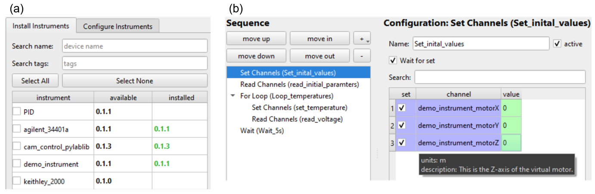

# Summary

NOMAD CAMELS is a configurable, open-source measurement software, that records fully self-describing experimental data. It has its origins in the field of experimental physics where a wide variety of measurement devices are used in rapidly changing experimental setups. CAMELS is designed with focus on full recording of data and metadata, allowing others to understand the data and the exact measurement procedure employed. CAMELS provides a user-friendly graphical user interface (GUI) which allows the user to define instrument control and measurement protocols. The GUI provides a low entry threshold enabling the creation of new measurement protocols without requiring programming knowledge or deep understanding of device communication. CAMELS generates Python code to interface with instruments, allowing users to customize the code for specific applications and arbitrary device implementation if needed. Existing large-scale, distributed control systems using EPICS can be natively implemented. 
CAMELS allows researchers to take their first steps towards a FAIR-data pipeline and reproducible science.

# Statement of need
Research data management has peaked greater and greater interest in recent years with large research funding agencies emphasizing the importance of well-founded research data strategies in their treatment of proposals. The key goal is to create research data following the **FAIR** (**f**indable, **a**ccessible, **i**nteroperable and **r**e-usable) principles [@Wilkinson2016] and thereby improve world-wide research.
While electronic lab notebooks are an important step towards FAIR data it is equally important to start recording FAIR measurement data as early as possible in the research workflow. 

In experimental physics many custom-built measurement setups are controlled by a very specific software written by individual researchers. This results in a fully heterogeneous landscape of software solutions for measurements written in many different languages and with often poor documentation, making it almost impossible for other researchers to extend or alter it. The degree to which the saved raw data is understandable varies greatly but is often unintelligible even for researchers from same lab. The recording of metadata such as instrument settings or the actual measurement steps performed to obtain the final raw data are almost never recorded. Resulting in raw data that can only be understood by individual researchers or a very specific group of people, standing in the way towards FAIR research data. Although there are some tools available (e.g. _SweepMe!_ [@SweepMe], _iC_ [@pernstich2012]) to realise the control of arbitrary measurement instruments, they are usually not open-source or their data output is not compliant to the FAIR principles. 

{ width=80% }

# NOMAD CAMELS
CAMELS is an open-source tool that automatically collects all experimental metadata automatically for every measurement. It features a user-friendly graphical interface that enables the creation and customization of measurements without the need for programming knowledge. The data is output in a structured HDF5-file format that closely resembles the NeXus format [@Konnecke2015] while remaining agnostic to the specific measurement performed. The final HDF5-file contains both the actual measurement data and metadata in a single file, adhering to the FAIR principles. 

Moreover, CAMELS allows for direct access to the _NOMAD_ [@Draxl2019] online repository or a local database installation called _NOMAD Oasis_ enabling the use of their electronic lab notebook (ELN) features. The user can select sample data from _NOMAD_ and link it with the measurement to then directly upload the measured data, providing a simple and stream-lined data workflow.

The _bluesky_ software [@Allan2019; @bluesky] initially developed to control instruments at large-scale research institutions using EPICS [@Knott1994; @EPICS] is the backbone of CAMELS and orchestrates the device communication. This allows CAMELS to seamlessly integrate with any existing lab infrastructure running EPICS. A schematic overview of the functionality of CAMELS is displayed in \autoref{fig:camel_overview}.

CAMELS provides a comprehensive set of functionalities that can be split into three primary components: the instrument management, measurement protocols and manual controls. 

## Instrument Management
Instruments can be added to NOMAD CAMELS in two ways. The first involves using the instrument manager to add instruments for which drivers already exist. The manager obtains these drivers from the official, curated driver repository [@CAMELS_drivers]. Subsequently, these drivers are installed to the Python environment via _pip_ [@PipDocumentationV23], with each driver being packaged individually.

The second way, is to add drivers by creating the necessary files locally and placing them in the folder specified in the NOMAD CAMELS settings. To facilitate this process CAMELS provides a _driver builder_ that automatically generates the essential structure and boilerplate code. This approach is recommended for users intending to create their own drivers. As CAMELS is an open-source project developed by and for the community, users are encouraged to contribute by creating pull requests for new drivers on the driver repository.

In general, a CAMELS driver comprises two files: one containing the hardware interface, the other defining the controllable instrument settings. Instruments consist of _channels_ that can be set and read and correspond to an individual functionality or physical property of the instrument.

## Measurement protocols
Coming from experimental physics, the _measurement protocol_ in CAMELS is a distinctive sequence of setting and measuring instruments (see \autoref{fig:manager_protocols}). This yields a measurement in a 'recipe-style' format, where the next step is executed after the successful completion of each preceding step.  
  
CAMELS translates the protocol created in the GUI into a Python script, which is then executed. The script can be modified and run without CAMELS, permitting
complex modifications of the measurement as required. Additionally, users can export and import the scripts on different systems running CAMELS, enabling the sharing of entire measurement procedures.

The individual steps in the protocol are predefined building blocks that perform various functions such as writing commands to the instruments, reading data from instruments, and even creating complex, parametrized measurement scans. Individual instrument drivers can integrate custom steps, such as a PID-controller that adds the ability to wait for the desired value stabilize.

## Manual Controls
Certain devices require manual control before complex measurement routines can be started, such as adjusting stages or the specification of particular temperature. _Manual controls_ allow the user to control individual instruments without having to create a complete protocol in advance.
Each instrument may provide its own manual controls.

## Data output

After executing the measurement protocol, the time-stamped data is saved in an HDF5-file with a structure similar to that of the NeXus format [@Konnecke2015]. Data can also be exported in CSV format, with the metadata exported in JSON, enabling the use of existing workflows.

The data can be divided into distinct sections. The most significant among these are the actual measured data generated from protocol steps like reading channels, the metadata containing all instrument settings, metadata containing information about the steps performed and the Python script (see \autoref{fig:h5_data}), and metadata related to sample information and user information.

# Documentation
In-depth documentation and guides for installing, using and troubleshooting can be found on the CAMELS documentation [website](https://fau-lap.github.io/NOMAD-CAMELS/) [@fuchsCAMELSConfigurableApplication].

# Acknowledgements

FAIRmat is funded by the the Deutsche Forschungsgemeinschaft ”DFG, German Re- search Foundation” – project 460197019.

# References